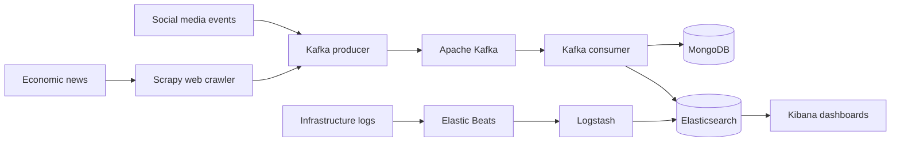

# Arquitectura Big Data: Pipeline y Monitorización

Trabajo de Fin de Máster centrado en el diseño y la construcción de una arquitectura Big Data capaz de cubrir el ciclo de vida del dato: captura, ingesta, distribución, almacenamiento, procesamiento, monitorización y visualización.

El proyecto parte de un caso de uso relacionado con información económica. La arquitectura recopila noticias y otros eventos, los distribuye mediante una plataforma de mensajería, los almacena de forma distribuida y centraliza los registros de la infraestructura para facilitar su análisis operativo.

## Objetivos

- Capturar noticias de prensa económica mediante web crawling.
- Diseñar un flujo de ingesta preparado para la llegada masiva de eventos.
- Almacenar documentos JSON en una base de datos distribuida y tolerante a fallos.
- Recopilar, transformar y analizar los logs generados por servicios y sistemas.
- Construir visualizaciones y dashboards para supervisar la infraestructura.
- Explorar la aplicación de Machine Learning al análisis de anomalías y de NLP al sentimiento de textos económicos.

## Arquitectura propuesta

El flujo combina dos áreas principales:

1. **Pipeline de datos:** Scrapy obtiene contenido de fuentes económicas; Apache Kafka desacopla productores y consumidores; MongoDB actúa como base de datos documental principal y Elasticsearch facilita la consulta y el análisis.
2. **Monitorización:** Beats recoge logs, métricas, tráfico de red y eventos de seguridad; Logstash transforma y enriquece los eventos; Elasticsearch los indexa y Kibana permite explorarlos mediante búsquedas, visualizaciones y dashboards.

## Tecnologías estudiadas

- **Captura de datos:** Python, Scrapy y XPath.
- **Mensajería e ingesta:** Apache Kafka, productores y consumidores Java.
- **Almacenamiento:** MongoDB y Elasticsearch.
- **Observabilidad:** Filebeat, Metricbeat, Packetbeat, Auditbeat y Logstash.
- **Visualización:** Kibana, Discover, dashboards y APM.
- **Analítica avanzada:** X-Pack Machine Learning y procesamiento de lenguaje natural como líneas de evolución.
- **Infraestructura:** Ubuntu y máquinas virtuales sobre VirtualBox.

## Contenido de la memoria

La memoria desarrolla los siguientes bloques:

1. Introducción, planteamiento del problema y objetivos.
2. Caso de negocio aplicado a inversión y análisis de información económica.
3. Captura de datos mediante web crawling con Scrapy.
4. Distribución de eventos con Apache Kafka.
5. Almacenamiento distribuido con MongoDB y Elasticsearch.
6. Análisis y centralización de logs con Elastic Stack.
7. Visualización y monitorización con Kibana.
8. Aplicaciones de Machine Learning con X-Pack.
9. Conclusiones y futuras líneas de trabajo.

## Documentos

- [Memoria en PDF](./%5BSpanish_Version_2029%5DArquitectura_Big_Data_Pipeline_y_Monitorizacion.pdf)
- [Memoria editable en Word](./%5BSpanish_Version_2029%5DArquitectura_Big_Data_Pipeline_y_Monitorizacion.docx)

## Alcance

La memoria recoge una prueba de concepto construida en un entorno local con máquinas virtuales. Este repositorio conserva la documentación académica del proyecto y no incluye una distribución ejecutable completa de la infraestructura.

Como evolución del trabajo se plantean la migración a la nube con Docker y Kubernetes, la incorporación de un orquestador como Apache Airflow, el procesamiento de datos en streaming y el análisis de sentimiento sobre las noticias recopiladas.

## Contexto académico

- **Autor:** Enrique Benito Casado
- **Titulación:** Máster Universitario en Análisis de Grandes Cantidades de Datos / Big Data Analytics
- **Institución:** Universidad Europea de Madrid, Escuela de Arquitectura, Ingeniería y Diseño
- **Director:** Jesús Carretero
- **Curso académico:** 2018-2019
- **Fecha de presentación:** septiembre de 2019
