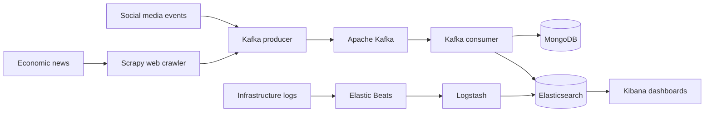

# Big Data Architecture: Pipeline and Monitoring

This master's thesis focuses on designing and building a Big Data architecture that covers the complete data lifecycle: capture, ingestion, distribution, storage, processing, monitoring, and visualization.

The project is based on a use case involving financial information. The architecture gathers news and other events, distributes them through a messaging platform, stores them in distributed systems, and centralizes infrastructure logs to support operational analysis.

## Objectives

- Capture financial news through web crawling.
- Design an ingestion flow capable of handling large volumes of incoming events.
- Store JSON documents in a distributed, fault-tolerant database.
- Collect, transform, and analyze logs generated by services and systems.
- Build visualizations and dashboards to monitor the infrastructure.
- Explore Machine Learning for anomaly detection and NLP for sentiment analysis of financial texts.

## Proposed Architecture

The architecture combines two main areas:

1. **Data pipeline:** Scrapy collects content from financial sources; Apache Kafka decouples producers from consumers; MongoDB serves as the primary document database; and Elasticsearch supports search and analysis.
2. **Monitoring:** Beats collects logs, metrics, network traffic, and security events; Logstash transforms and enriches the events; Elasticsearch indexes them; and Kibana enables exploration through searches, visualizations, and dashboards.

## Technologies Covered

- **Data capture:** Python, Scrapy, and XPath.
- **Messaging and ingestion:** Apache Kafka, with Java producers and consumers.
- **Storage:** MongoDB and Elasticsearch.
- **Observability:** Filebeat, Metricbeat, Packetbeat, Auditbeat, and Logstash.
- **Visualization:** Kibana, Discover, dashboards, and APM.
- **Advanced analytics:** X-Pack Machine Learning and natural language processing as future development paths.
- **Infrastructure:** Ubuntu and virtual machines running on VirtualBox.

## Thesis Contents

The thesis covers the following areas:

1. Introduction, problem statement, and objectives.
2. A business case focused on investment and financial information analysis.
3. Data capture through web crawling with Scrapy.
4. Event distribution with Apache Kafka.
5. Distributed storage with MongoDB and Elasticsearch.
6. Log analysis and centralization with the Elastic Stack.
7. Visualization and monitoring with Kibana.
8. Machine Learning applications with X-Pack.
9. Conclusions and future work.

## Documents

- [English Markdown edition](./thesis-en/README.md)
- [Practical continuation of the project in 2026](./continuation-2026/README.md)
- [Original thesis archive (Spanish PDF and Word files)](./archive/original-spanish-thesis/README.md)

## Scope

The thesis documents a proof of concept built in a local environment using virtual machines. This repository preserves the project's academic documentation and does not include a complete, executable distribution of the infrastructure.

Potential future developments include migrating the architecture to the cloud with Docker and Kubernetes, adding an orchestrator such as Apache Airflow, introducing stream processing, and performing sentiment analysis on the collected news.

## Academic Context

- **Author:** Enrique Benito Casado
- **Degree:** Master's Degree in Big Data Analytics
- **Institution:** Universidad Europea de Madrid, School of Architecture, Engineering and Design
- **Supervisor:** Jesús Carretero
- **Academic year:** 2018–2019
- **Submission date:** September 2019
