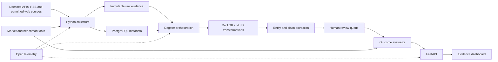

# 2026 Continuation: Market Evidence Platform

This directory turns the 2018-2019 academic concept into a practical, verifiable project for 2026.

The original question remains valuable:

> Can reproducible data show whether a public claim about a financial asset eventually proved correct?

The proposed evolution is not a trading bot. It is an **evidence-based market intelligence platform** that preserves what was said, interprets the claim, observes what happened afterward, and publishes a traceable result.

## What changes from the original project

| Academic project | 2026 continuation |
|---|---|
| Demonstrate many technologies | Solve one end-to-end use case first |
| Positive or negative sentiment | Extract a testable asset, direction, and horizon |
| Store a document | Preserve immutable evidence, provenance, hashes, and revisions |
| Compare with a later price | Evaluate several horizons against a benchmark |
| Give an author a simple score | Report sample size, calibration, and uncertainty |
| Run separate services on virtual machines | Start with a reproducible local environment; add cloud and streaming when justified |
| Treat Machine Learning as future work | Version, evaluate, and supervise models from the beginning |

## First product

The MVP will monitor a small, declared asset universe. Each day it will:

1. Ingest documents from permitted sources such as APIs, RSS feeds, or authorized crawling.
2. Preserve an immutable copy and its provenance metadata.
3. Detect entities and extract testable claims.
4. Allow a reviewer to approve or correct automated extractions.
5. Retrieve adjusted asset and benchmark prices.
6. Evaluate each claim when horizons such as 1, 5, and 20 trading sessions expire.
7. Display the evidence, result, and aggregate metrics by author and source.

A minimal claim looks like this:

```json
{
  "asset_id": "example-asset",
  "stance": "bullish",
  "published_at": "2026-08-14T08:00:00Z",
  "horizon_sessions": 5,
  "source_quote_span": [420, 516],
  "extraction_confidence": 0.86,
  "model_version": "claim-extractor-v1"
}
```

The platform does not need to redistribute complete articles. Each source policy will determine whether it stores the content, a permitted excerpt, or only the URL, metadata, and content hash.

## Proposed architecture



### Deliberately small initial stack

- **Python** for connectors, normalization, evaluation, and the API.
- **PostgreSQL** for operational metadata, entities, claims, and reviews.
- **Parquet** for analytical history and raw data that may legally be retained.
- **DuckDB + dbt** for local transformation and analysis.
- **Dagster** for scheduling, dependencies, retries, and data-asset observability.
- **FastAPI** for serving results.
- **Streamlit** for validating the dashboard before investing in a dedicated frontend.
- **OpenTelemetry + Grafana** when the system has enough services to justify distributed observability.

Kafka or Redpanda, Iceberg, Spark or Flink, Kubernetes, and a cloud provider remain possible extensions. They will be introduced only when a measurable requirement for volume, latency, concurrency, or availability demands them.

## Project principles

1. **Evidence before models.** No assessment is published unless it can be traced to its source and version.
2. **Real time only when necessary.** The daily MVP may be batch-oriented while preserving a path toward events.
3. **No temporal leakage.** An evaluation may use only information available at the historical decision time.
4. **Reproducibility.** Data, code, configuration, prompts, and models are versioned.
5. **Human review.** Uncertain extractions enter a review queue.
6. **Relative, cost-aware results.** Market direction is compared with a benchmark; later simulations include costs and risk.
7. **Not financial advice.** The product measures historical claims and does not promise returns or automate trades in the MVP.

## Directory contents

- [Vision and scope](./docs/VISION_AND_SCOPE.md): users, value proposition, evaluation model, and boundaries.
- [Evolutionary architecture](./docs/ARCHITECTURE.md): initial components, growth path, and technology decisions.
- [Roadmap](./docs/ROADMAP.md): phases, deliverables, and exit criteria.

## Recommended next step

Build one vertical slice with **one source, one market-data provider, ten assets, and a five-session horizon**. The first milestone is not deploying Kafka or training a complex model. It is proving that a claim published today can be stored, interpreted, and evaluated automatically five sessions later with complete traceability.
