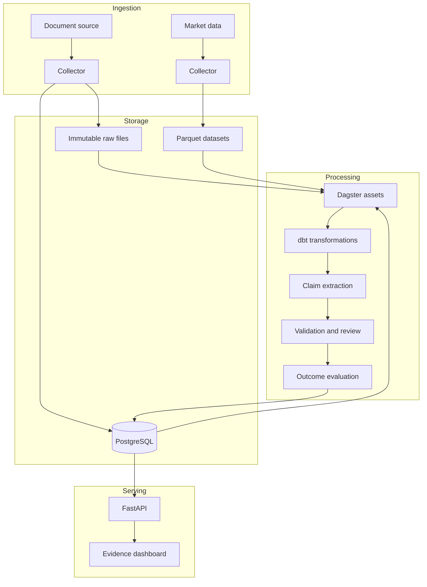
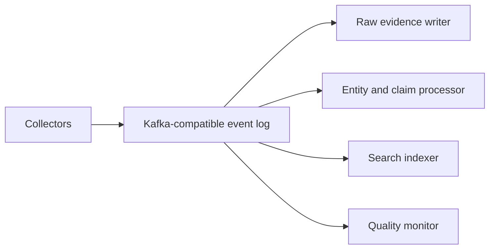

# Evolutionary Architecture

## Primary decision

The architecture will grow in response to demonstrated needs. The project will continue to teach data engineering and architecture, but every tool must solve an observable problem.

## Stage 1: local and reproducible

Everything should start with one command through containers, except embedded tools. Secrets are injected through the environment and never committed to Git.

### Data layers

- **Raw:** original response or a legally permitted representation, HTTP metadata, capture time, and content hash.
- **Normalized:** documents, authors, sources, assets, and prices under common schemas.
- **Enriched:** mentioned entities, extracted claims, confidence, and reviews.
- **Evaluated:** returns, benchmark comparison, correctness rules, and methodology version.
- **Serving:** stable views for the API and dashboard.

### Contracts and quality

Every connector validates its output before publication. At minimum:

- non-null keys and timestamps;
- uniqueness and idempotency by source identifier and version;
- explicit UTC timestamps;
- referential integrity among claims, documents, assets, and prices;
- reasonable continuity in market series;
- quarantine for invalid records without silent loss;
- counts, freshness, and error rates exposed as metrics.

## Stage 2: events and search

Kafka or Redpanda is introduced if independent consumers, event replay, or intraday latency become necessary. Elasticsearch or OpenSearch returns only if search behavior and volume justify another data store.

A suggested threshold for the event log is that more than one real consumer must process the same event independently, or the service-level objective can no longer be met through batch orchestration.

## Stage 3: lakehouse and cloud

Parquet may evolve into Apache Iceberg when the platform has concurrent writers, frequent schema evolution, snapshot requirements, or multiple query engines. S3-compatible storage can replace the local directory without changing the logical data model.

A managed deployment or Kubernetes arrives only when users, availability requirements, and an operating budget exist. Until then, Docker Compose and continuous integration provide more useful learning per unit of complexity.

## Stage 4: advanced experimentation

- Compare rules, specialized financial models, and LLMs.
- Register datasets, prompts, models, evaluations, and costs.
- Detect source and entity drift.
- Backtest with temporal splits and explicit leakage prevention.
- Introduce Flink only for stateful, windowed intraday use cases.
- Keep portfolio simulation separate from the evidence pipeline and always include costs, risk, and a benchmark.

## Technology evolution map

| Capability | Initial choice | Conditional evolution |
|---|---|---|
| Ingestion | Python + HTTP/API/RSS | Kafka-compatible log + schema registry |
| Orchestration | Dagster | Deployed Dagster or a managed service |
| Operational data | PostgreSQL | Managed PostgreSQL and replicas |
| Analytics | Parquet + DuckDB + dbt | Iceberg + Trino/Spark/Flink |
| NLP | Rules + versioned model | Inference service and model registry |
| Search | PostgreSQL full-text search | Elasticsearch/OpenSearch |
| UI | Streamlit | Dedicated frontend + FastAPI |
| Observability | Structured logs and metrics | OpenTelemetry Collector + Grafana stack |
| Infrastructure | Docker Compose | Infrastructure as code + cloud; Kubernetes when operationally justified |

## Decisions required before implementation

1. Initial market and ten assets.
2. Documentary source and its storage/display rights.
3. Market-data provider, corporate-action adjustments, and usage limits.
4. Exact five-session horizon rule.
5. Benchmark and correctness threshold.
6. Initial corpus languages.
7. Monthly infrastructure and model budget.

## Technical references

- [Dagster asset-oriented orchestration](https://docs.dagster.io/)
- [DuckDB querying Parquet directly](https://duckdb.org/docs/current/guides/file_formats/query_parquet)
- [Apache Iceberg open table format](https://iceberg.apache.org/docs/latest/)
- [Redpanda compatibility with Kafka clients](https://docs.redpanda.com/streaming/current/develop/kafka-clients/)
- [OpenTelemetry traces, metrics, and logs](https://opentelemetry.io/docs/)
- [SEC EDGAR as an example public API for company filings and data](https://www.sec.gov/search-filings/edgar-application-programming-interfaces)
