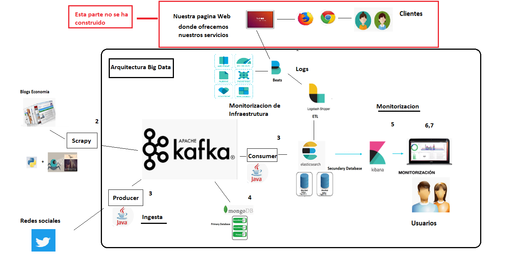

# Big Data Architecture: Pipeline and Monitoring

English Markdown edition of Enrique Benito Casado's Master's Thesis, submitted to the European University of Madrid during the 2018-2019 academic year.


> This edition translates and restructures the original Spanish Word document for reading on GitHub. Technical meaning, chapter order, examples, and figure numbering are preserved. Minor wording and typographical issues have been normalized for clarity. The original [Word document](../%5BSpanish_Version_2029%5DArquitectura_Big_Data_Pipeline_y_Monitorizacion.docx) and [PDF](../%5BSpanish_Version_2029%5DArquitectura_Big_Data_Pipeline_y_Monitorizacion.pdf) remain the authoritative academic submission.

## Academic information

- **Title:** Big Data Architecture: Pipeline and Monitoring
- **Author:** Enrique Benito Casado
- **Degree:** Master's Degree in Big Data Analytics
- **Institution:** European University of Madrid, School of Architecture, Engineering and Design
- **Supervisor:** Jesús Carretero
- **Academic year:** 2018-2019
- **Submission:** September 2019

## Abstract

This project designs a system that covers the data lifecycle from capture and ingestion to distributed storage, processing, monitoring, and visualization. Economic-news articles are collected with web-crawling scripts. Apache Kafka supports and distributes high-volume event streams. MongoDB stores JSON documents as the primary distributed database, while Elasticsearch supports search and log analysis. Logstash and the Beats family collect, transform, and enrich operational events, and Kibana presents the resulting information through searches, visualizations, and dashboards.

The work is written mainly from a data-engineering perspective and gives particular attention to observability in a Big Data infrastructure. It also explores Machine Learning for anomaly detection and proposes Natural Language Processing and sentiment analysis as future extensions for evaluating economic commentary.

**Keywords:** Big Data, web crawling, Scrapy, Apache Kafka, MongoDB, Elasticsearch, Logstash, Beats, Kibana, monitoring.

## Contents

For a close, paragraph-by-paragraph rendering of the complete source body, see the [complete English translation](complete/full-thesis.md). The chapter links below provide an edited edition optimized for technical reading on GitHub.

1. [Introduction](chapters/01-introduction.md)
2. [Business Case: Investment with Big Data and Machine Learning](chapters/02-business-case.md)
3. [Data Capture: Web Crawler](chapters/03-data-capture.md)
4. [High-Volume Event Distribution with Apache Kafka](chapters/04-apache-kafka.md)
5. [Storage: MongoDB and Elasticsearch](chapters/05-storage.md)
6. [Log Analysis with the Elastic Stack](chapters/06-log-analysis.md)
7. [Data Visualization with Kibana](chapters/07-kibana.md)
8. [Machine Learning with X-Pack](chapters/08-machine-learning.md)
9. [Conclusions and Future Work](chapters/09-conclusions.md)
10. [References and Bibliography](chapters/10-references.md)

## Architecture overview



*Figure 1. Complete project overview.*

The architecture joins two related flows:

- A data pipeline that gathers economic content, distributes events through Kafka, and persists JSON documents in MongoDB and Elasticsearch.
- A monitoring pipeline in which Beats collects operational signals, Logstash processes them, Elasticsearch indexes them, and Kibana supports investigation and visualization.

## Repository layout

```text
thesis-en/
├── README.md
├── chapters/
│   ├── 01-introduction.md
│   └── ...
└── assets/
    └── figures/
        ├── manifest.json
        └── source-image-*.{png,jpg,gif}
```

The images are the original embedded DOCX resources. Their checksums, source media names, dimensions, and paragraph positions are recorded in [`manifest.json`](assets/figures/manifest.json). They can be extracted again with [`tools/extract_docx_assets.py`](../tools/extract_docx_assets.py).
