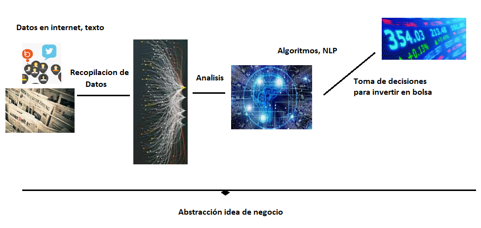

# 2. Business Case: Investment with Big Data and Machine Learning

## 2.1 Introduction

The example organization, Enriis-Consulting, considers whether investment decisions can be improved by identifying useful signals in financial news and social-media content. The proposal is not to trust any individual opinion automatically, but to collect evidence and measure how authors' statements compare with later market movements.

*Figure 2. Business idea: data collection, analysis, NLP, and investment decisions.*

## 2.2 Problem statement

Specialist financial outlets continuously publish forecasts, recommendations, and commentary. Readers have little assurance that these claims will prove accurate. Tracking a large number of articles manually is impractical, and comparing each statement with later prices requires a reproducible data pipeline.

The system must answer questions such as:

- Who wrote the article?
- When was it published?
- Which company, product, or financial instrument does it discuss?
- Is the author's position positive, negative, or neutral?
- How did the relevant asset behave after publication?
- Has the author historically produced reliable assessments?

The first technical requirement is therefore to capture and preserve the source material. The stored records can subsequently be enriched with financial-market data and used by analytical models.

## 2.3 Business model

Natural Language Processing would make it possible to classify the sentiment of an article and identify the entities it discusses. Market data could then be joined to each observation, producing a historical measure of how well a writer's views anticipated later outcomes.

The intended workflow is:

1. Collect text from the economic press and selected social platforms.
2. Normalize author, date, topic, and article content.
3. Apply NLP to identify entities and sentiment.
4. Compare the statement with later changes in the referenced asset.
5. Calculate reliability indicators for authors and sources.
6. Use those indicators as one input to investment decisions.

The thesis builds the data-engineering and monitoring foundation for this idea. It does not claim to implement a profitable trading model. NLP, market-data integration, and automated decisions are presented as later stages.

*Figure 3. Examples of the Spanish financial press used as potential sources.*

[Back to contents](../README.md#contents)
