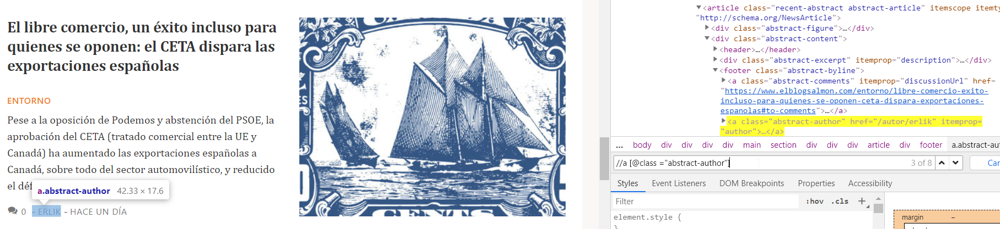
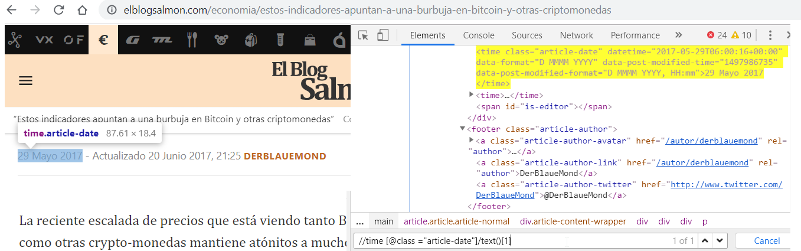
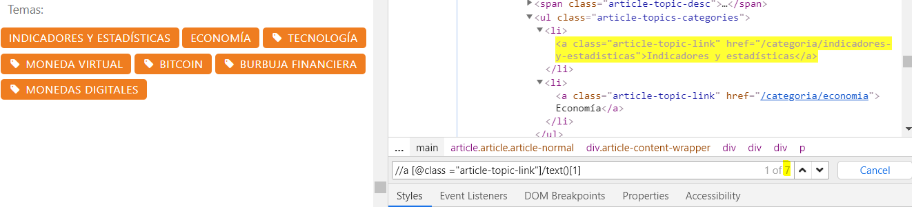
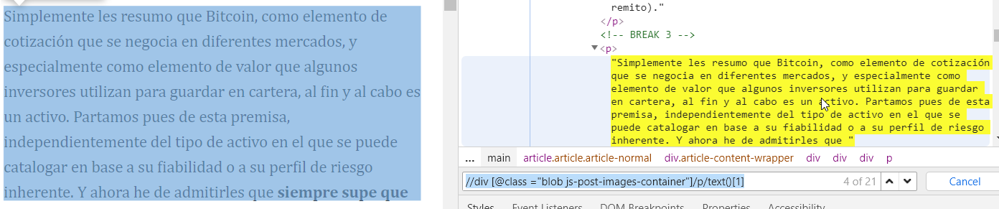
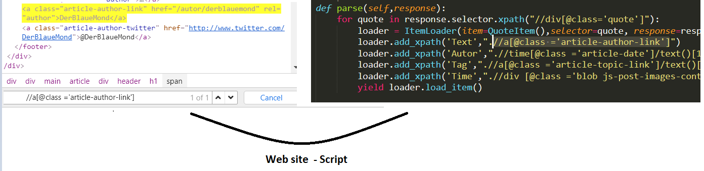
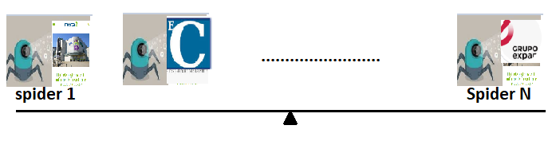

# 3. Data Capture: Web Crawler

The project obtains its initial dataset from specialist economic publications. A web crawler is used to visit pages, select the relevant fields, and serialize the result as structured data.

## 3.1 Introduction to web crawling

Web crawling is the automated extraction of information from web pages. Text, images, video references, links, and metadata can all be collected when the page structure is understood.

### 3.1.1 Scrapy

Scrapy is a Python framework designed for crawling and extracting structured data. Its main components include:

- **Spiders**, which define the pages to visit and the fields to extract.
- **Items**, which describe the structure of the collected record.
- **Item pipelines**, which clean, validate, and persist extracted items.
- **Downloader and spider middlewares**, which process requests and responses.
- **The engine**, which coordinates data flow between components.
- **The scheduler**, which queues requests and helps avoid duplicate work.

Scrapy was selected over simpler parsing libraries because the project requires navigation, pagination, request scheduling, configurable throttling, and a clean route from extracted fields to JSON and MongoDB.

## 3.2 XPath selectors

XPath identifies nodes in an HTML or XML document. Browser developer tools help locate the element that contains a required field. A typical workflow is to select the visible element, inspect it, and refine an XPath expression until it uniquely identifies the desired value.

### 3.2.1 Author

The author's name is essential because the future analytical stage will compare that person's statements with later market outcomes.

```xpath
//a[@class="abstract-author"]
```



*Figure 4. Identifying the article author with XPath.*

### 3.2.2 Publication date

The publication date provides the temporal reference needed to measure how an asset changes after an article appears.

```xpath
//time[@class="article-date"]/text()[1]
```



*Figure 5. XPath selector for the publication date.*

### 3.2.3 Topics

Topics indicate which financial asset or subject the article discusses.

```xpath
//a[@class="article-topic-link"]/text()[1]
```



*Figure 6. Selecting article tags.*

### 3.2.4 Article text

The text is the principal input for later sentiment analysis. A simplified selector used during the proof of concept was:

```xpath
//div[@class="blob js-post-images-container"]/p/text()[1]
```



*Figure 7. Selecting the article body.*

## 3.3 Building the spider

Once the fields have been identified, they are added to a Scrapy spider. The associated project files serve different purposes:

- `items.py` defines and cleans the JSON output fields.
- `settings.py` contains global behavior, including robots.txt handling and request limits.
- `middlewares.py` can process generated requests and items.
- The spider contains the start URLs, parsing logic, and pagination rules.



*Figure 8. Mapping fields from the website into the crawler script.*

### 3.3.1 Pagination

A crawler must move beyond the first result page to obtain historical content. Scrapy allows the parser to identify the next-page URL and create another request until no continuation is available. This is a major advantage when the objective is to build a longitudinal dataset rather than download a single visible page.

## 3.4 Avoiding bans

Website administrators use rate limits, robots rules, traffic analysis, CAPTCHAs, user-agent checks, and IP-based controls to protect their services. A responsible crawler should minimize load and respect the site's policies.

Recommended practices include:

- Avoid aggressive request rates.
- Limit concurrency.
- Enable automatic throttling.
- Respect `ROBOTSTXT_OBEY` where required.
- Identify the crawler with a meaningful user agent and contact email.
- Cache responses during development.
- Handle errors and retries without creating request storms.

These practices reduce operational risk and make the data-collection process more transparent.

## 3.5 Integrating ingestion into the architecture

A project may require multiple spiders because each publication has a different HTML structure. The spiders should nevertheless produce a common logical schema so that downstream systems receive consistent fields.



*Figure 9. A collection of source-specific spiders feeding the common pipeline.*

During the initial proof of concept, Python and PyMongo wrote records directly to MongoDB. This works for a small number of sources, but tight coupling becomes difficult to maintain as the number of producers and consumers grows. The next chapter introduces Kafka as the event-distribution layer.

[Back to contents](../README.md#contents)
