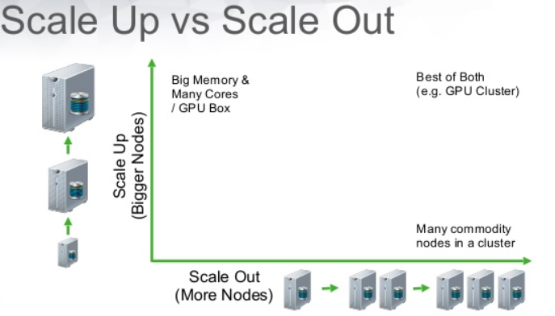
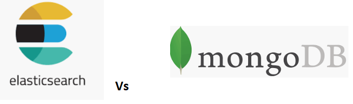
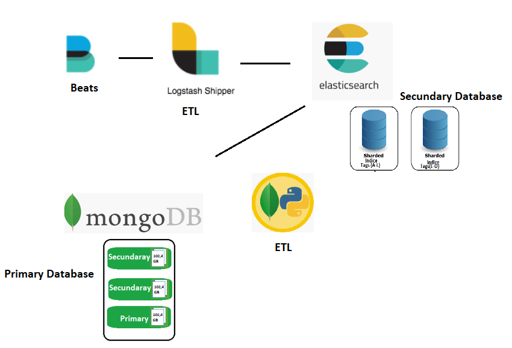
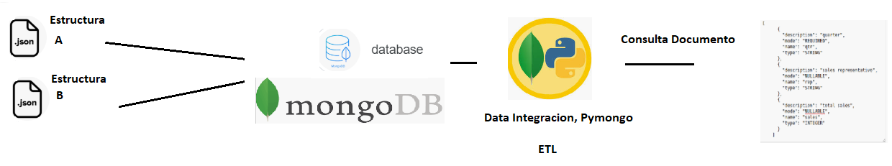
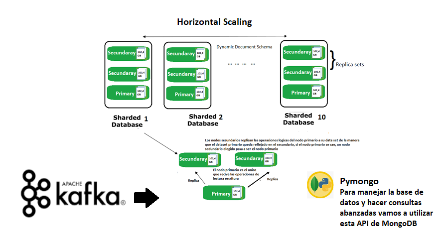

# 5. Storage: MongoDB and Elasticsearch

## 5.1 Scale up and scale out

A Big Data storage platform must cope with continued growth and tolerate failures. Vertical scaling adds CPU, memory, or faster storage to one machine. Horizontal scaling distributes the workload across multiple commodity nodes.

*Figure 21. Vertical and horizontal scaling.*

The project favors horizontal scaling because the expected dataset and operational event volume can grow continuously. Distributed systems also provide replication and fault-tolerance options that are difficult to achieve with a single machine.

## 5.2 MongoDB and Elasticsearch

MongoDB and Elasticsearch both store JSON-like documents and support horizontal scaling, but they are optimized for different responsibilities.

*Figure 22. Elasticsearch and MongoDB.*

MongoDB is selected as the primary database for application records. It provides document-oriented persistence, flexible schemas, replica sets, and sharding. Elasticsearch is used as a secondary analytical and search database, especially for logs, full-text search, aggregations, and operational dashboards.

Using both databases avoids forcing a single platform to satisfy every transactional and analytical requirement.

*Figure 23. MongoDB as primary storage and Elasticsearch as a search and monitoring store.*

## 5.3 MongoDB in the infrastructure

Records arrive as JSON documents from web crawlers, Kafka consumers, and future services. PyMongo provides the Python integration used by the crawler. An ETL or synchronization process can send selected fields to Elasticsearch when search and monitoring capabilities are required.

*Figure 24. Data integration around MongoDB.*

### 5.3.1 Schema on read and schema on write

Relational systems normally enforce a schema when data is written. Document databases allow greater flexibility: records can evolve and consumers can interpret the structure when they read them. This is useful when different economic publications expose slightly different metadata.

Flexibility does not eliminate the need for governance. The ingestion layer should still normalize critical fields such as source, author, publication date, URL, topics, text, and collection timestamp.

### 5.3.2 Primary database and fault tolerance

A MongoDB replica set contains one primary node and one or more secondary nodes:

- The **primary** receives writes.
- **Secondaries** replicate the operation log and maintain copies of the dataset.
- If the primary fails, eligible members hold an election and select a new primary.

Sharding distributes collections across multiple shard groups, enabling horizontal growth when one replica set is no longer sufficient.

*Figure 25. Kafka ingestion, MongoDB replica sets, sharding, and PyMongo access.*

The thesis recommends testing the design with realistic workloads, validating failure behavior, monitoring replica lag, and selecting shard keys carefully. High availability depends on correct deployment and operations, not only on choosing a distributed database.

[Back to contents](../README.md#contents)
