# 6. Log Analysis with the Elastic Stack

## 6.1 Why centralized log analysis is required

A Big Data infrastructure produces events continuously. Every device, service, database, web server, and security control generates logs. Searching each host manually with tools such as `grep` or `find` becomes impractical as the platform grows.

The project uses the Elastic Stack to centralize these signals:

- **Beats** collects logs, metrics, packets, and security events.
- **Logstash** parses, transforms, and enriches events.
- **Elasticsearch** indexes and searches the resulting documents.
- **Kibana** provides exploration, visualization, and dashboards.

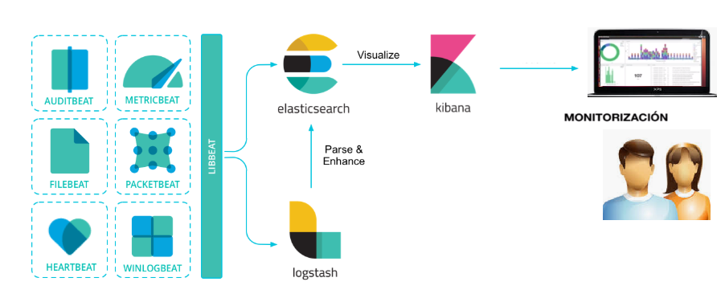

*Figure 26. Elastic Stack monitoring module.*

## 6.2 Elasticsearch architecture

Elasticsearch exposes application-layer HTTP APIs and uses network transport between nodes. A cluster contains one or more nodes with different responsibilities.

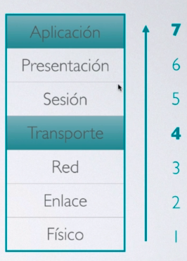

*Figure 27. Elasticsearch in the OSI model.*

### 6.2.1 Nodes

A node is an Elasticsearch instance. Cluster deployments may include:

- **Master-eligible nodes**, which manage cluster state and elections.
- **Data nodes**, which store shards and execute data operations.
- **Ingest nodes**, which run preprocessing pipelines.
- **Coordinating nodes**, which route requests and merge results.

Roles and terminology vary across Elasticsearch versions, but the architectural principle is to distribute responsibilities and avoid a single point of failure.

### 6.2.2 Indices and documents

Every event stored in Elasticsearch is a document. Documents are serialized as JSON and grouped into indices. An index is comparable to a logical collection, but the relational table analogy is imperfect because documents may be nested and the search engine uses mappings and an inverted index.

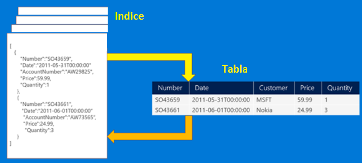

*Figure 28. Simplified comparison between an Elasticsearch index and a relational table.*

An index is divided into primary shards. Replica shards provide additional copies for availability and can also serve search traffic. A healthy production cluster should distribute primaries and replicas across separate nodes.

## 6.3 Elasticsearch APIs

Elasticsearch provides REST APIs for cluster administration, index management, document operations, and search.

### 6.3.1 Cluster status APIs

Useful requests include:

```http
GET /
GET /_cluster/health
GET /_cluster/state
GET /_cluster/stats
GET /_nodes
GET /_nodes/stats
GET /_cat/master?v
GET /_cat/indices?v
GET /_cat/health?v
```

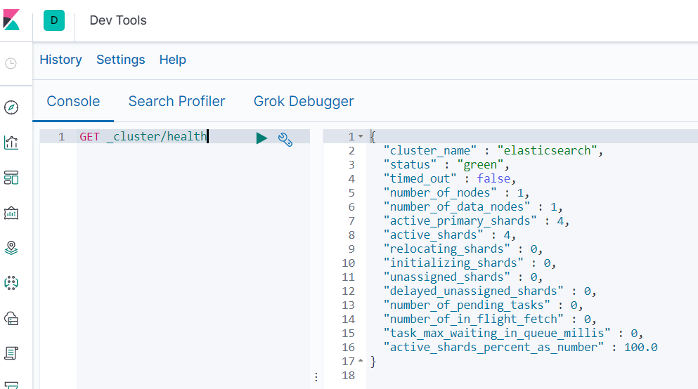

*Figure 29. Checking cluster state with Kibana Dev Tools.*

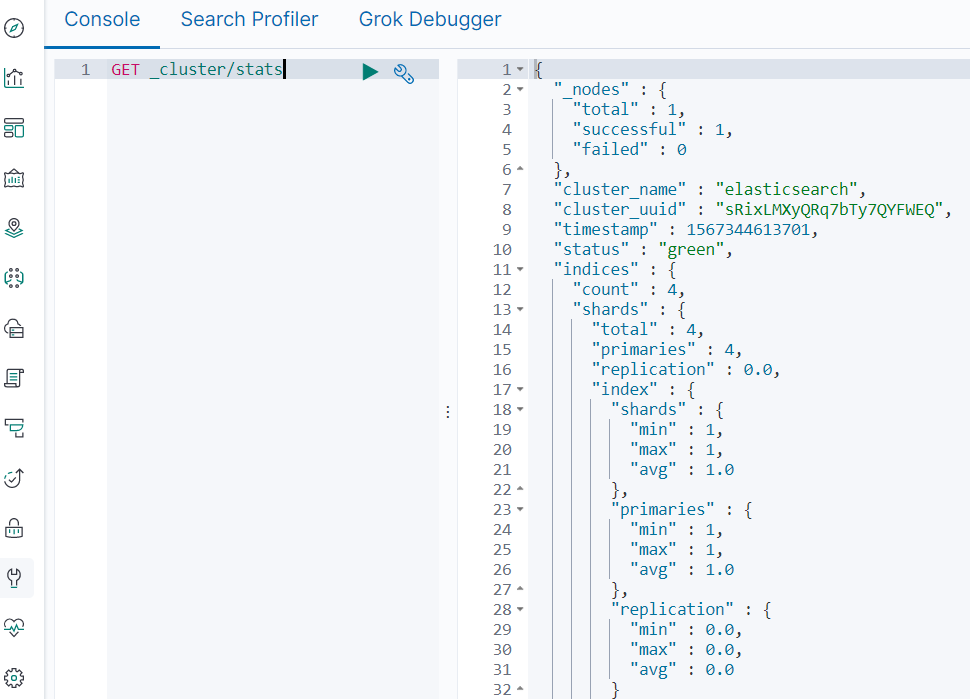

*Figure 30. Detailed cluster state response.*

The `_cat` APIs present compact human-readable views of cluster information.

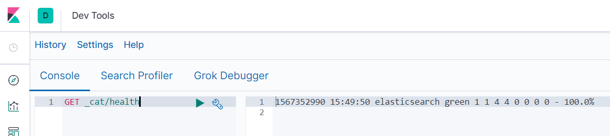

*Figure 31. Checking cluster health.*

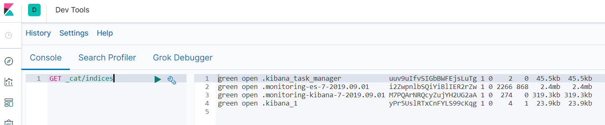

*Figure 32. Listing indices.*

### 6.3.2 Index and document APIs

A document can be indexed with an HTTP request:

```http
PUT /salmon/_doc/1
Content-Type: application/json

{
  "author": "Enrique Benito",
  "source": "financial press",
  "text": "Example economic-news record"
}
```

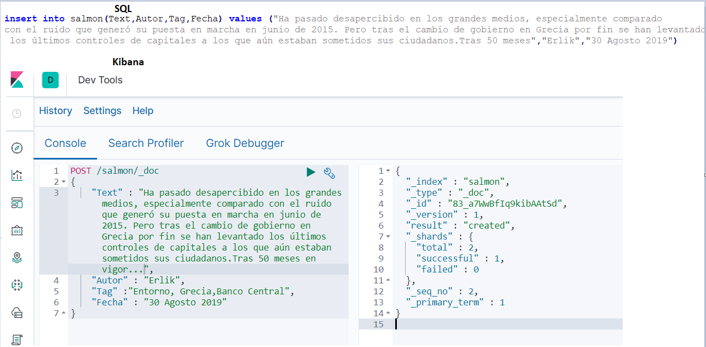

*Figure 33. SQL insert compared with an Elasticsearch document request.*

Documents can then be read, deleted, or updated:

```http
GET /salmon/_doc/1
DELETE /salmon/_doc/1
POST /salmon/_update/1
```

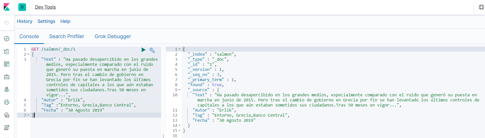

*Figure 34. Reading a document by identifier.*

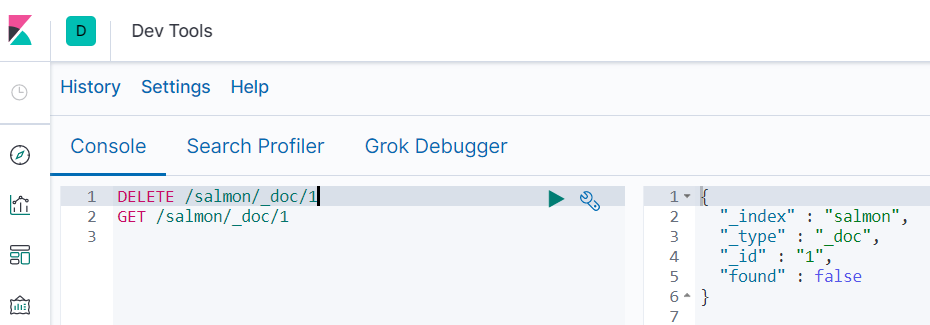

*Figure 35. Deleting and querying a document in Kibana.*

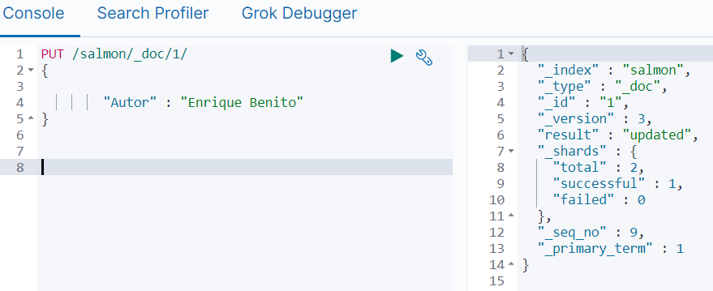

*Figure 36. Updating a document.*

Search requests can use query-string syntax or JSON Query DSL. Search templates support repeated queries whose parameters change between executions.

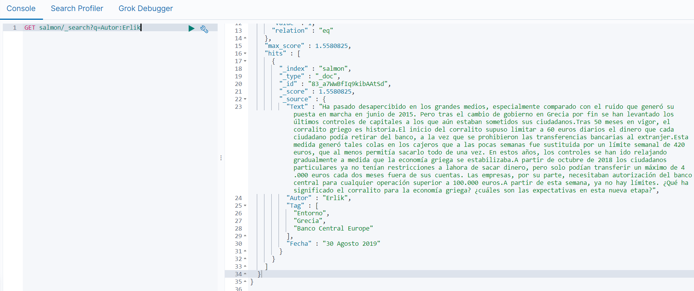

*Figure 37. Performing search queries.*

## 6.4 Beats

Beats are lightweight data shippers. They can send events directly to Elasticsearch or route them through Logstash when parsing and enrichment are needed.


### 6.4.1 Filebeat

Filebeat tails text files and forwards new lines. In this project it monitors Apache access logs. Those logs contain information such as client address, time, requested resource, status code, user agent, and response size.

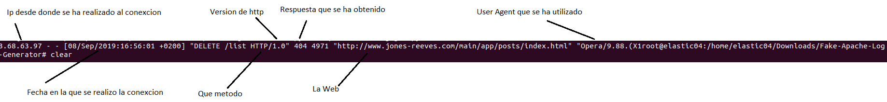

*Figure 38. Example log event collected by Filebeat.*

A Filebeat input identifies the paths to monitor:

```yaml
filebeat.inputs:
  - type: log
    enabled: true
    paths:
      - /home/elastic04/Downloads/Fake-Apache-Log-Generator/*.log
```

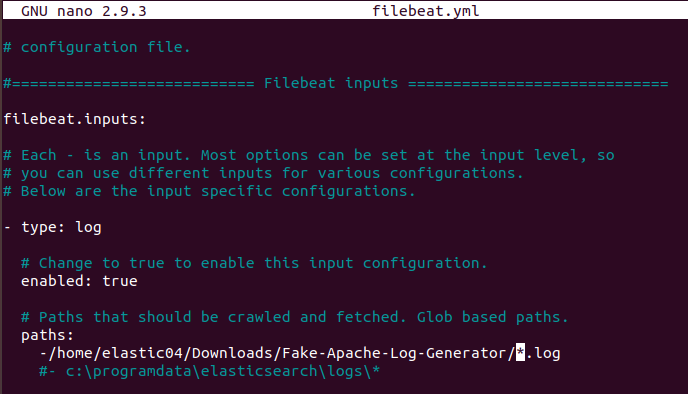

*Figure 39. Configuring the path to Apache logs.*

The service can be started and checked with the host's service manager.

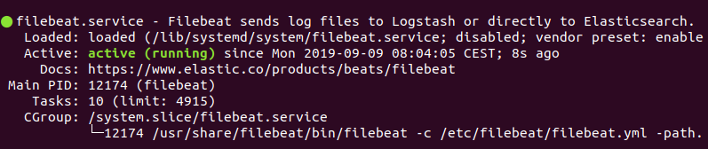

After indexing, Kibana can verify that events arrive and display their distribution over time.

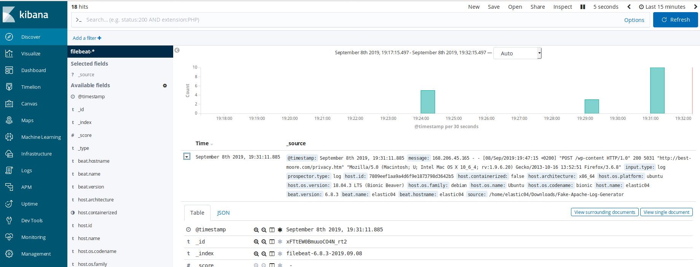

*Figure 40. Filebeat events in Kibana.*

### 6.4.2 Metricbeat

Metricbeat collects host and service metrics such as CPU, memory, disk, process, and network statistics. Predefined modules and Kibana dashboards accelerate initial monitoring.

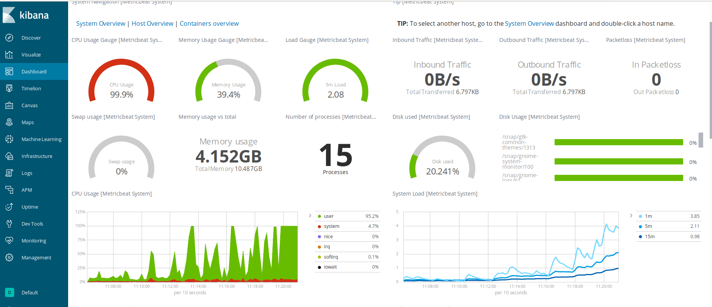

*Figure 41. Metricbeat metrics in Kibana.*

### 6.4.3 Packetbeat

Packetbeat observes network traffic, recognizes supported application protocols, and produces transaction-level events. It is useful for understanding request latency, errors, and communication between services.

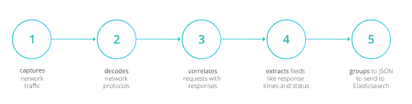

*Figure 42. Packetbeat processing sequence.*

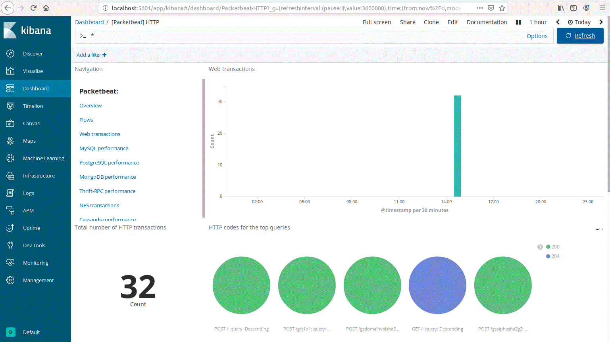

*Figure 43. Packetbeat data visualized in Kibana.*

### 6.4.4 Auditbeat and Libbeat

Auditbeat collects security and operating-system events, including audit framework activity and file-integrity information. Libbeat is the shared framework used to build the Beats family and can support custom shippers when official Beats do not cover a data source.

## 6.5 Logstash

Logstash introduces a processing layer between collection and indexing.

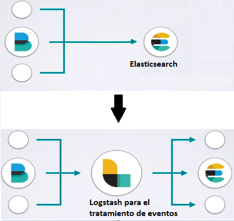

*Figure 44. Processing events with Logstash.*

A Logstash pipeline has three stages:

```text
input -> filter -> output
```

### 6.5.1 Installation and basic tests

A minimal standard-input pipeline can be used to test the service:

```text
input { stdin {} }
output { stdout { codec => rubydebug } }
```

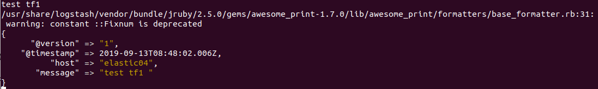

*Figure 45. Testing and monitoring Logstash.*

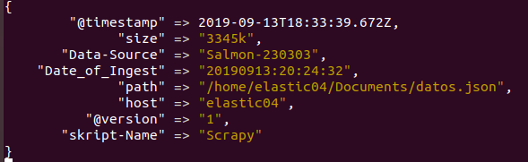

*Figure 46. Logstash output in the terminal.*

### 6.5.2 Transformations

The `mutate` filter can rename fields, remove unwanted values, convert data types, and perform substitutions.

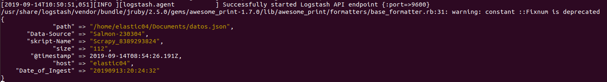

*Figure 47. First transformation in Logstash.*

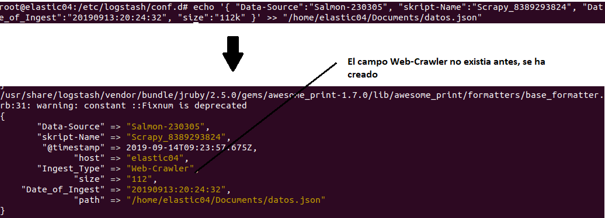

*Figure 48. Result of an additional transformation.*

The `grok` filter converts an unstructured log line into named fields. Once the request, response code, client IP, timestamp, user agent, and other elements have distinct fields, Elasticsearch can aggregate them efficiently.

### 6.5.3 Monitoring the infrastructure

In the integrated pipeline, Filebeat sends Apache logs to Logstash. Logstash parses and enriches the events and writes them to Elasticsearch.

```text
Filebeat -> Logstash -> Elasticsearch -> Kibana
```

GeoIP enrichment converts a client IP address into geographic attributes that can be displayed on a map.

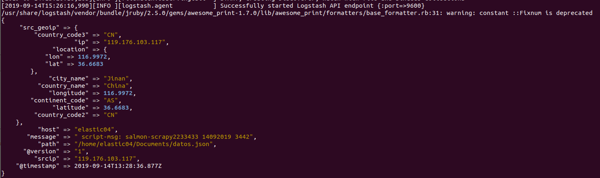

*Figure 49. Activating geolocation enrichment.*

An illustrative pipeline is:

```text
input {
  beats { port => 5044 }
}

filter {
  grok {
    match => { "message" => "%{COMBINEDAPACHELOG}" }
  }
  date {
    match => ["timestamp", "dd/MMM/yyyy:HH:mm:ss Z"]
  }
  geoip {
    source => "clientip"
  }
}

output {
  elasticsearch {
    hosts => ["localhost:9200"]
    index => "apache-%{+YYYY.MM.dd}"
  }
  stdout { codec => rubydebug }
}
```

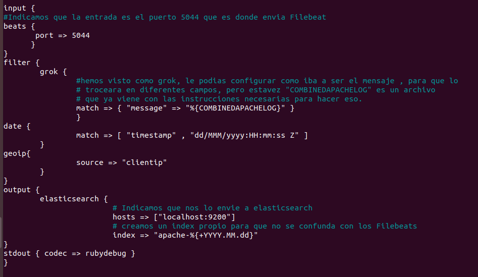

*Figure 50. Logstash configuration for the ETL flow.*

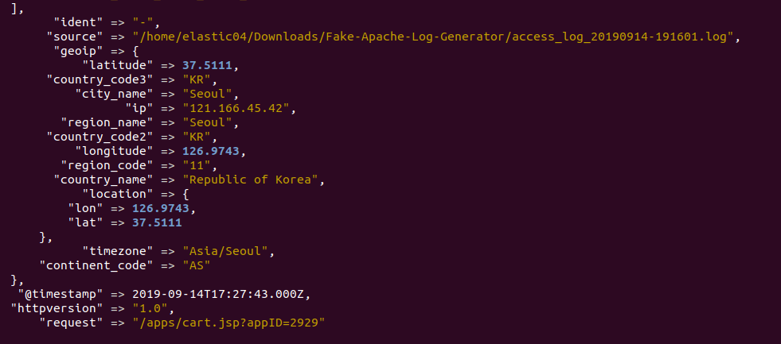

*Figure 51. Geolocation data arriving correctly.*

### 6.5.4 Mapping geographic coordinates

Elasticsearch mappings determine how fields are indexed. Latitude and longitude should be represented as a `geo_point` field to support geographic queries and Kibana maps.

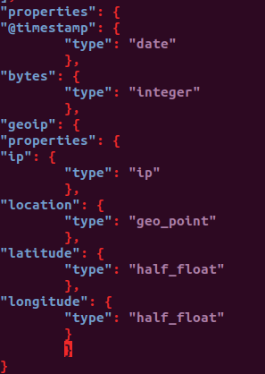

*Figure 52. Custom mapping properties.*

The template can be installed through the API:

```bash
curl -X PUT 'http://localhost:9200/_template/apache' \
  -H 'Content-Type: application/json' \
  -d @/etc/logstash/templates/apache_template.json
```

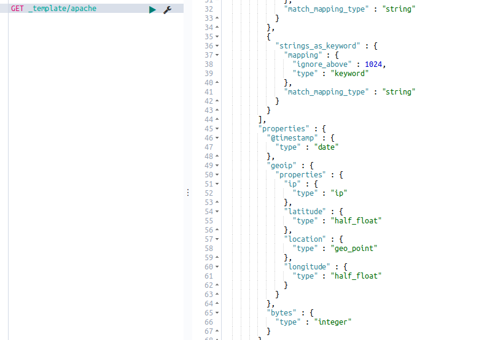

*Figure 53. Apache index template.*

Once the mapped events have been reindexed, Kibana can plot their locations.

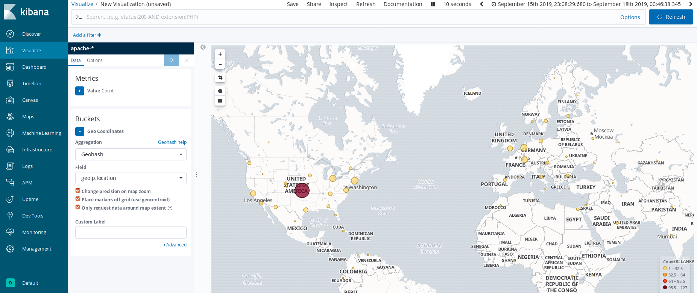

*Figure 54. Apache input logs displayed on a map.*

[Back to contents](../README.md#contents)
