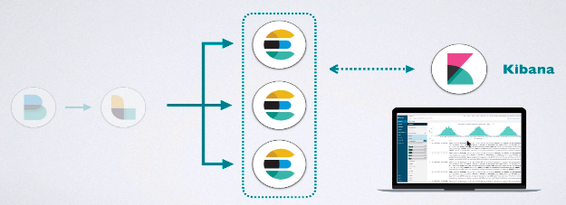
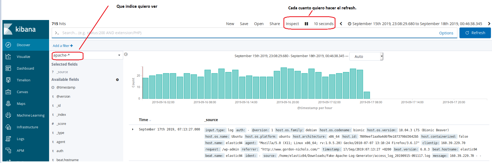
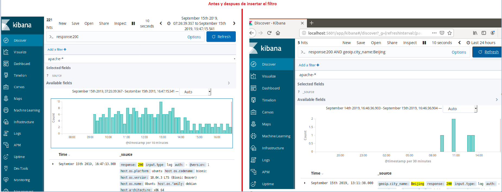
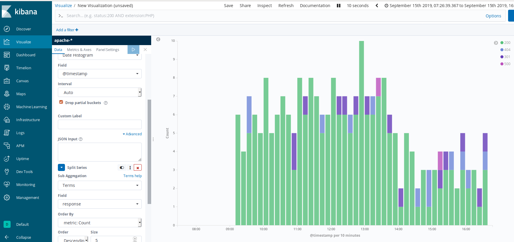
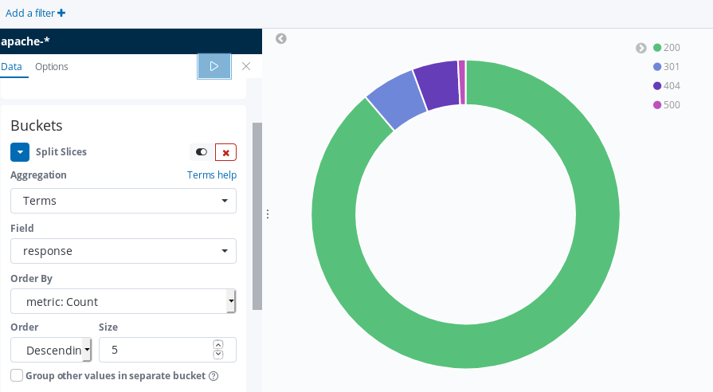
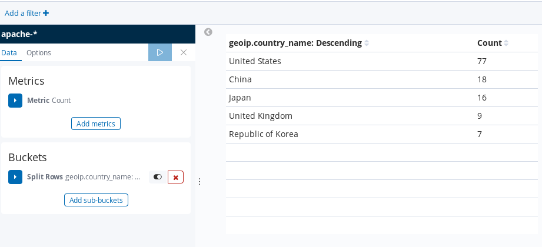
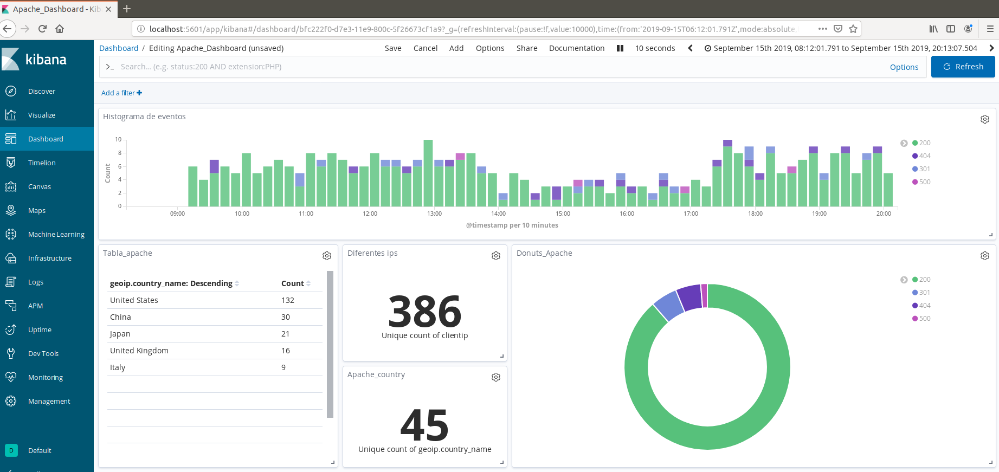

# 7. Data Visualization with Kibana

## 7.1 Introduction

Kibana is the visualization and analysis layer used with Elasticsearch. It provides interfaces for examining individual documents, filtering data, creating aggregations, building dashboards, managing indices, and monitoring applications.



*Figure 55. Elasticsearch clusters visualized through Kibana.*

## 7.2 Discover

Discover shows the documents contained in a selected index pattern. Users can choose a time range, inspect fields, enter queries, add filters, and control the refresh interval.



*Figure 56. Viewing logs in Discover.*

For example, a query can combine an HTTP response code with a geographic field:

```text
response:200 AND geoip.city_name:Beijing
```



*Figure 57. Adding a filter to the visualization.*

## 7.3 Visualizations and dashboards

Kibana visualizations summarize indexed events through aggregations. The proof of concept uses several forms.

### Bar chart

A date histogram groups events over time, while a terms aggregation can split the bars by HTTP response code.



*Figure 58. Bar chart divided by HTTP response.*

### Donut chart

A donut chart gives a compact overview of the relative frequency of response classes.



*Figure 59. Donut visualization.*

### Data table

A table ranks source countries by event count and supports precise comparison of categories.



*Figure 60. Tabular ranking visualization.*

### Combined dashboard

The dashboard combines the histogram, total metrics, donut chart, and table so that users can investigate the same filtered time range from several perspectives.



*Figure 61. Combined final dashboard.*

## 7.4 Application Performance Monitoring

Elastic APM extends monitoring from infrastructure signals to application behavior. Agents instrument supported applications and report transactions, spans, errors, and service dependencies. An APM deployment would help the example organization relate user experience to backend services and identify slow or failing requests.

[Back to contents](../README.md#contents)
