# Big Data Architecture: Pipeline and Monitoring - Complete Translation

> Automatically translated paragraph by paragraph from the body of the original Spanish DOCX and then structurally converted to Markdown. The edited chapter edition is available in the parent directory.

## Chapter 1. Introduction

The master's final work is mostly focused from the point of view of a Data Engineer, that is the person who will be responsible for creating systems and infrastructure to provide data wherever necessary. In addition, this project focuses on everything that corresponds to a monitoring of a Big Data infrastructure.

### Problem approach

Pipeline

The business idea that shapes this Big Data project is a small business that wants to start investing in stock exchange based on the analysis of opinions from both the internet and social networks and the written press specializing in economics.

Written press

From the different economic media (what is known as the salmon press), such as the economist, the salmon blog, the merchant2 etc... Daily articles are written about the good situation of certain companies that then collapse into stock market and vice versa, among so many tangles of articles it is really difficult to know who to trust. The average citizen who reads these economic news has really no guarantee that what he is reading about the economy is going to be true. The only way he would have to do this would be to follow an author and see if over time they have been right in their predictions.

Social networks(Twitter)

It is nothing new, in fact, there have been several talk about the power that has to analyze twitter to predict the stock market.

We as a company see twitter as another factor to analyze, another means of collecting data and studying them. We seek to find patterns and correlations between the behavior of the stock market.

Monitoring.

What happens inside a Big Data cluster is not a black box where we don't know what's going on, we want to do a log monitoring of what's happening to our infrastructure.

What are we gonna monitor?

Following the thread of a company that collects blog data analyzes them and wants to invest in stock exchange, this company has web servers where it offers our services, these servers generate user logs (or agents, or even attacks) that are visiting our services.

### Project objectives

The aim of this project is to verify and even amplify the knowledge gained from the master’s degree in “Large Data Analysis”, with special emphasis on the subject of “Data Management Systems and Infrastructure”.

### Work plan and technical description

The work plan for this MFF will be as follows:

Following the thread of a company that needs, extracting data from the web, storing them and analyzing them we will go looking at the tools that will allow us to carry out this process.

All chapters are presented as follows:

First, we make an introduction to the chapter, it is presented theoretically of the tool that we are going to use, gradually we are going up from level until a section arrives where we integrate the tool in our project. All chapters are open for future lines where we must include more and better functionalities to continue with the philosophy of continuous development.

Tools to be treated in this TFM

WEB – Crawler (Scrapy): Python offers the most powerful library today to extract data from web pages, we will see how this program works, we will understand the importance of X-path for extracting data from web pages.

At first we will see how to make queries about the website to find the data we are looking for.

Once we identify which fields or data we are interested in, we will write our script capable of capturing them automatically.

The last step will be to be able to write a first pipeline where when launching our script the data is stored directly in the database.

MongoDB: A Big Data project, I couldn't be carried out without a distributed, fault-tolerant data storage that can be scaled horizontally, MongoDB will be our chosen database.

Theoretical introduction to MongoDB and as we should climb it in the future, the practical part of MongoDB is given in paragraph 1, in combination with our Scrapy and Pymongo.

Elasticsearch: It is a database that shares all the features mentioned above in MongoDB, only this time it has to be said that it is oriented to be a search-engine that is very optimal to show the data that are already inserted

We will see how to work with Elasticsearch and the different options it offers as inserting new indices, data, view deleted etc...

Kafka: Kafka will be our event management tool, in this section we will introduce Kafka, see its most important components and create our own “producer” and “consumer” that will send the data to Elasticsearch.

We will have to create a developer account on Twitter and ask permission to collect your data, once twitter authorizes us to receive 4 security keys that will be our credentials in all our scripts that interact with Twitter.

Passwords are unique and should not be given to third parties, in case you want to reproduce this part the person will have to ask explicit authorization from Twitter and it will have to send you the keys.

We will create our “producer” and “consumer” in java and indicate that information is what we want to send.

Beats: The ELK stack provides “Beats” for everything that has to do with monitoring our infrastructure. We will install the different Beats services and monitor our team.

We will install Metricbeats, for monitoring our cluster, in our case what will be monitored is the virtual machine that is performing as a cluster simulator.

We will install Filebeat to monitor logs, since we do not have an installed Apache that makes us a web server that generates logs, these will simulate them for this we will use a github program written in Python that is called “Fake-Apache-Log-Generator” and generate the logs for us so that we can analyze them later.

We will install Auditbeat to monitor everything related to security within our infrastructure, it serves to say that user has entered a certain directory that we have specified.

Logstash: Another tool that ELK provides us that allows us to make small transformations in the data before sending them to Elasticsearch. In our project we will do different transformations in Logstash to clean the logs.

-We will use the different functions offered by Logstash and finally create a small ETL that will be able to read data that have been left by the fake log generator.

- We'll create a map in Kibana that shows us by ips where these logs are coming from.

Kibana: The latest tool provided by ELK and used in this project. Kibana is a very powerful monitoring tool that is linked to Elasticsearch.

In this section we will create different visualizations of our system to then join them together and create our own Dashboard. The data used for this section are the same as we had in paragraph 6, those created by the Logs generator.

We will use the ELK payment module (in our case we will test the 30-day trial version to carry out this project) X-Pack, its most advanced version to do machine learning about our logs. We will do two cases of ML use and see how to detect abnormal behaviors about our logs.

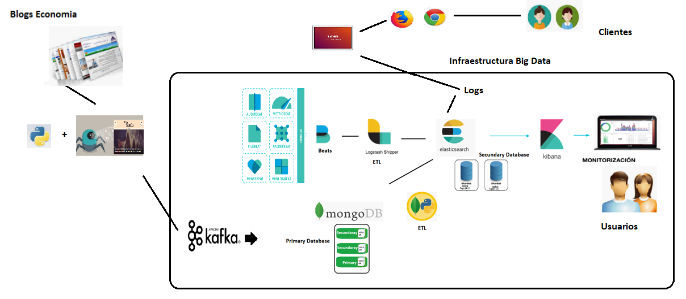


*Figure 1. Complete project overview.*

## Chapter 2. Business Case: Investment with Big Data and Machine Learning

### Introduction

Enriis-Consulting is a company that believes in the possibility of investing in stock exchange and earning money if we are able to identify the correct information that is on the internet.

To make such investments will focus on 2 data sources

- Opinions of economic media writers.
- Twitter analysis and social media.
One of the most repeated phrases in the Big Data world is “Data is the new oil” from Enriis-Consulting we really believe, the data (oil) is there, we need to simply find, collect and analyze them.

### Problem approach

In this section we want to focus on what problem we have come to solve, which our company brings to the world, what value we bring. From our company philosophy we are clear that you cannot make money without bringing value, that is to say if we want to make money is because we are providing a quality product. Below, we present the following challenges that have motivated the creation of this company.

Currently anyone can read different means of economy and start investing in the opinions he reads from the different experts, but he poses the following challenges.

Written press

How reliable are so-called financial experts writing every day in the economics sections?

From the different economic media (what is known as the salmon press), such as the economist, the salmon blog, the merchandise2 etc... Daily articles are written about the good situation of certain companies that then collapse into stock exchange and vice versa, among so many tangles of articles it is really difficult to know who to trust.

Can you invest in financial markets by guiding us only from the opinion of some writers?

The next logical question we could ask ourselves is, could you make money by investing in the stock market just by following the advice of these more reliable economists?

There is one fact that has encouraged us to push this research project forward and is none other than the famous experiment “A Random Walk on Wall Street”

“To check whether the experts’ successes were random or not, according to Malkiel, a competition between professionals and a choice of actions was to be made completely random. The metaphor for this random selection was to imagine a monkey blindfolded by throwing darts at the page with the stock list of The Wall Street Journal. Then the returns of the portfolios of both contenders would be compared... What is surprising is that when the annual behavior of the portfolio of securities chosen randomly by the monkey was compared with that of the investment funds referenced to the US market, the monkey’s portfolio had exceeded 85% of the funds.”

The main problem with this experiment was that it treated all investment managers as a block, and this was not the case, there would be people whose predictions were always good and others whose predictions were bad.

Can the average citizen who reads economic news rely on the opinion of these experts?

The average citizen who reads these economic news has really almost no guarantee that what he is reading about economy is going to be true, the only way he would have to do this would be to follow an author and see if over time they have been right in their predictions.

Can artificial intelligence, thanks to the collection of thousands of historical data and the help of the NLP (Natural Language Processing), bring clarity to this issue?

What would be the consequence of collecting huge amounts of Data with the power of artificial intelligence. The data would come as Terabytes' way of collecting articles that have been written on the internet in the economic press sections.

The power of NLP would be to make an analysis of feeling, that is to say to be able to answer the following question: Is the author speaking positively/negatively/neutrally about the company/product/value in the future? Automatically you could answer this question thanks to Maschine Learning and her text recognition analysis.

Once we have collected the data and processed them to know if an author makes a negative or neutral positive criticism of a product missing the third leg that would be to compare it with how it has evolved in the market. So you could know what percentage of success a writer has on economics. Later you can continue to analyze more in depth.

What percentage is correct about a particular topic?

It is possible that our writer is not a reliable person when talking about macroeconomics, but yet every time he speaks blockchain always right, in this sense it would be interesting to take him into account only when he talks about the subject he really understands.

How reliable is X months?

It is possible that the short-term writer tends to be right, but in the long and medium term not or vice versa.

Social networks

In the case of social networks in our case Twitter, we pose another series of challenges, on the one hand we could ask ourselves the same questions as in the previous section about different characters who write about economies to analyze whether their opinions are relevant or not, but also opens up the possibility of massive analysis of feelings, trends etc...

Our team of data scientists will be in charge of finding these correlations between data and behaviour of the stock market. Moreover, it is not a new topic, but rather that we have recorded studies on this subject, and we know that it is possible.

### Business model

Since Enriis-Consulting we have two business models.

Invest our money.

We really believe in our product and therefore we are the first ones to use our money to invest in stock exchange based on the recommendations of our system are us. Once we have identified that authors have credibility and on which topics we have a percentage of success to invest in the products that you are talking about, our idea is to invest in those products and get an economic return. This is really the core of our business because if we are not able to make correct analyses and money from our investments we will not be able to sell our portfolio of investment to customers.

Investment portfolio for customers.

Our business model also means offering our services to customers who want to place their trust with us, from the profits of these customers we would get a percentage. Enriis-Consulting has a company website where we offer our investment services to private customers.


*Figure 2. Business idea.*

## Chapter 3. Data Capture: Web Crawler

The data with which we are going to nourish ourselves in this project comes from the economic press written, more specifically the so-called salmon press (merca2, the Economist, Expansion, Five Days, The Salmon Blog).


*Figure 3. Financial press.*

### Introduction to Web-Crawler

Web-Crawler is a term used to refer to the concept of extracting data from web pages. Everything seen on a web page can be extracted object, this includes, text, images, videos, emails etc...

#### Scrapy

Scrapy is a framework open source, for the collection of data from web pages. Previously there were different libraries able to do Web-crawling as well as for example BeatifulSoup, the problem is that these libraries were not suitable for really complex projects. A differential factor of Scrapy on other frameworks is pagination, Scrapy allows in a simple way to extract the information not only from a web page but to browse previous pages of the web that we are visiting. This is a fundamental element because what we try is to download the historical one.

The Scrapy framework is based on 5 components described below.

##### Spiders

In the Spider component we will define what we want to extract from the web page in question. There are 5 different types of Spiders (ScrapySpider, CrawlSpider, XMLFeedSpider, CSVFeedSpider, SitemapSpider).

##### Pipelines

This component will be used to clean data, remove duplicates and save data in an external database.

##### Middlewares

This component has everything you need in relation to the request and response (Request/Response) to a website.

##### Engine

He is responsible for coordinating all the above-mentioned components.

##### Scheduler

He is responsible for ensuring order in operations.

### XPath Selectors

#### Introduction

Before building our script in Scrapy we need to know what is really in our interest of the website in question, that is, we do not want to download all the content of the website because it is full of metadata that does not interest us for our future analysis.

Every website we want to do crowding will need to have a specific script adapted to your XML structure.

XPath(XML Path Language) is a “Query language” used to select nodes from XML or HTML documents. There are 4 types of nodes:

- Element Node: Represents the “tags” in an HTML document
- <p></p>, <h1></h1>, <div></div> …
- Attribute Node: Representing Attributes of an Element Node
- @href, @id, @class.
- Comment Node: Represents the comment you make in an HTML document.
- Text Node: Represents the text contained within an Element Node.
#### Identifying our XPath.

The first thing we have to be clear about is knowing that data will interest us for our analysis, that is to say that attributes we will want to insert into our database, for its subsequent analysis. Our analysis identifies four fundamental pillars: Author, Tags, Text, Publication date.

Within our economics press we will describe how our Xpath is built for “the Salmon Blog”:

https://www.elblogsalmon.com/economia/estos-indicadores-apuntan-a-una-burbuja-en-bitcoin-y-otras-criptomonedas

To find the Chrome google development tools you have to follow the following steps:

- Choose item that interests us.
- Right button, inspect, this will open up the development tool windows.
- Cntrl + F to find search.
What we need now is to identify the instruction that leads to the attributes we need.

Author

The first and most important thing will be to collect, the name of the author who wrote the article in the newspaper, we need this field so that when we analyze the comments he has written and compare it as the market has behaved in the months ahead we can determine if he is a person we should trust his opinions on in the future.

The instruction in Xpath that leads us to identify the author in a unique way is as follows:

```text
//a [@class ="abstract-author"]
```


*Figure 4. Author XPath.*

Date of publication

We need to know the date of publication because it will be the reference in the time when the team of data scientists will base themselves to know how the asset of which you speak evolves, with respect to the author's opinion.

The instruction in Xpath that leads us to identify the date of publication in a unique way is as follows:

```text
//time [@class ="article-date"]/text()[1]
```


*Figure 5. Publication-date XPath.*

Tags

When we go to process the text we will need to know what financial assets were being discussed.

```text
//a [@class ="article-topic-link"]/text()[1]
```


*Figure 6. Selecting tags.*

Text

The text is the main component that was used in the future for analysis. On the text a feeling analysis will be carried out to know if the author was casting a positive, negative or neutral opinion on such financial asset.

By doing the analysis of feeling about the text, and seeing the evolution of financial assets over time, it can be determined whether their forecasts on assets were correct or not and therefore give more or less credibility to the author of the article.

```text
//div [@class ="blob js-post-images-container"]/p/text()[1]
```


*Figure 7. Article text.*

### Building our Spider

Once we know the attributes we need and we have identified them through Xpath, the next thing we need is to build a script where we're going to pass on those attributes we've identified before.

The following scripts in Scrapy have to be modified to adapt them to the website from which we will extract the information.

Items.py : This is where we will put the necessary modifications so that our output in json is seen in the best possible way.We will remove leftover blanks and other values that do not provide anything.

Settings.py: Here we will indicate the general instructions. That is to say if we want you to obey the Robot.txt etc..

Middelwares.py: It is a framework that is used to process requests and elements that are generated from spiders.


*Figure 8. From the website to the script.*

#### Pageing

One of the reasons why we decided to use Scrapy and not another web-crawler library like BeatifulSoup is that Scrapy allows us to easily browse the website, that is to say we are not interested only in downloading what we see, as in this case we are interested in collecting all the historical, we must go forward through the website.

In this case we will call the function:

next_page=response.selector.xpath("//a[@class='next_page']/@href").exct_first()

### Avoiding being banished

When we try to download the content of a website we may be banned. This type of baneo comes with an error: “429 Too Many Request HTTP status code”

#### Techniques used by web administrators to prevent Web-Crawler from making them

Then we go on to detail the different techniques that are carried out.

Rate Limit Request: Limits the number of requests a webside can handle in a number of times, requests have to come from a single ip adress. If you exceed the number of requests that the system administrator has set as Rate limit, the server will return a response to us from “http status code 429”.

User-Agent indefinite: One technique used to avoid being scanned by robots is to deny requests to the web if the User-Agent is not defined.

Detection through the “honeypots”: It is about attracting potential attackers or bots to see how they behave.

#### Web-Crawling Best Practices

Once we have seen how Web pages can block us, we will now explain how to avoid being banned.

##### Avoid aggressive requests

Do not let our Crawler ask for many requests in a very aggressive way. In this sense a scrapy bot can be considered as a DDOS attack.

##### Adjust the number of requests

One way to lower the number of requests is by activating the attribute “DOWNLOAD_DELAY” = 5, for example, by making a request every 5 seconds.

##### Enable Throttle Extension

This is what it does, it automatically adjusts the speed of requests.

##### Obey ROBOTSTXT_OBEY

We must activate “true” the ROBOTSTXT_OBEY

##### Create an email for User_Agent

Providing an email at the USER_Agent can make companies having problems with our spider decide to contact us.

All these techniques work to avoid being temporarily banbed, if we are definitely vain, we should do a router “Reboot” to get another IP Address.

Finally, remember that all techniques might not work, as there are certain websites that use advanced techniques to prevent data from being collected on them.

### Integrate intake into our architecture

Throughout chapter 2 we have seen how it is to create a spider to, make Web-Crawler from a web page. Now, a Big Data architecture is obviously not built if we just need to extract data from a web page, there are hundreds of web pages/blogs/periodics from which we want to extract information.


*Figure 9. Collection of spiders.*

Obviously we cannot let hundreds of events interact with the database simultaneously, what we will need is an event manager, and it is here that our next element comes into play in our architecture: KAFKA..

## Chapter 4. High-Volume Event Distribution with Apache Kafka

### Introduction to Kafka

To introduce us to Kafka, we have to go back to chapter 1, to the part about how we inserted the data into MongoDB. That part worked properly because we were at the beginning, we had a script that inserted into a database, that is to say we had a source system and an objective system.

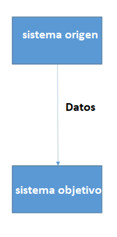

*Figure 10. Original point-to-point ingestion.*

The problem is that we are building a Big Data architecture where we are not going to insert data from one system but from hundreds.

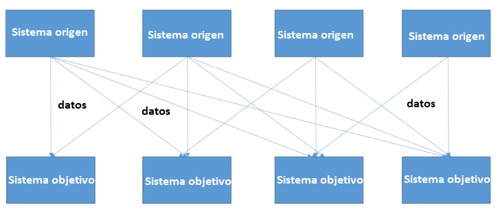

*Figure 11. Ingestion in a Big Data system.*

If we only have 4 target and source systems we would have to write 16 integrations, in a Big Data system and not going to be 4 but many more.

Each integration consists of:

- Choose the protocol: That is how the data is transported (TCP,HTTP,REST,FTP,JDBCV..)
- Data format ( Binary, CSV, JSON,Avro..)
- Data schema.
How do we solve this?

This is where Apache Kafka appears.

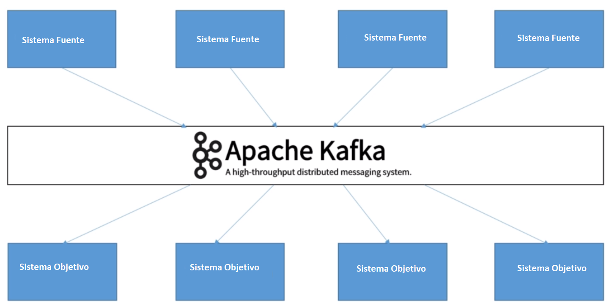

*Figure 12. Kafka in action.*

The data is distributed in Kafka which acts as a transport mechanism, it is a queue system. It is used by more than 2000 companies, and by 35% of the 500 most powerful companies.

Kafka, is distributed, and tolerant of failures.

#### Kafka Foundations

Kafka is scaled horizontally

It has a great performance (a latency of less than 10ms) – real time.

#### Kafka Theory

Topics: It is the basis of everything in Kafka, represents a portion of data, is similar to a table in SQL and is identified by a name.

Partitions: The “topics” are divided into partitions, each partition is in an orderly manner and each message within a partition gets an incremental id called offset.

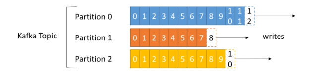

*Figure 13. Kafka topics.*

The order is guaranteed within a partition.

Data in Kafka is only kept for a certain time, usually a week. Once the data is written, they cannot be changed, they are immutable.

Kafka cluster: A Kafka cluster is made up of many Brokers, a broker is nothing more than a server. Each broker is identified by an ID that has to be an integer (we cannot name it any name we want).

Broker: Each broker does not contain all the information, but part of it, since Kafka is a distributed system. The minimum number of brokers, which is recommended is 3 when we want to create a cluster in Kafka.

Replication Factor in Kafka: We can choose the replication factor of our partition, obviously if we want our system to be fault tolerant it has to be greater than 1.

The number advised is to have replication 3.

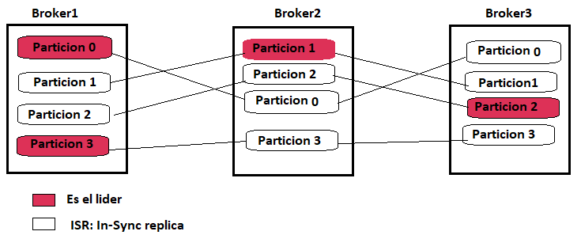

*Figure 14. Kafka replication.*

Producers: Write data to topics, act as an automatic load balancer. Consumer: Read data from topics, data is read in order, within each partition.

Consumer offset: It is the mechanism Kafka has in case a server falls, to identify where you should start reading the topics again (to avoid reading them from the beginning).

Zookeeper: Organize brokers, help the leader choose partitions, send notifications to Kafka in case of changes (broker fall, new topic, deleted topic etc.).Kafka cannot work without Zookeeper, and that is why we have to have it booted and running before we can

Guarantees in Kafka:

- Messages accumulate in the partitions in the order they have been sent.
- Consumers read messages in the order they have been saved (FIFO)
- With a N replication factor, producers and consumers can tolerate a failure of N-1 brokers.
- It is recommended to have as replication factor 3.
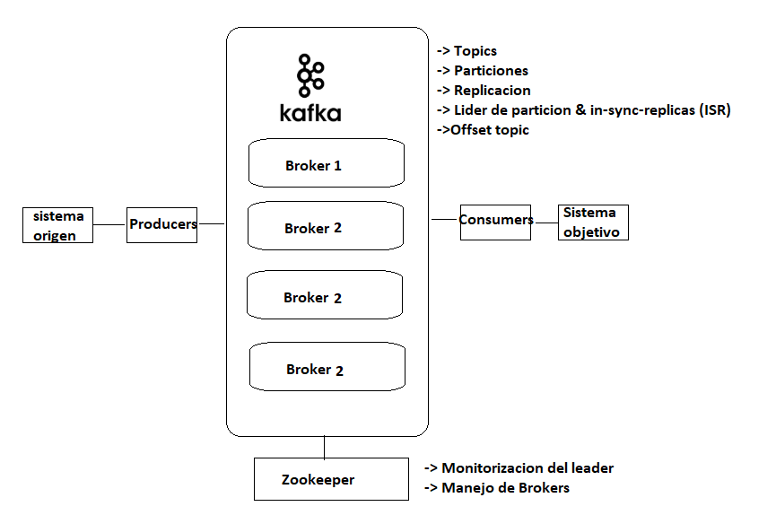

*Figure 15. Kafka theory summary.*

### CLI Kafka (Command Line Interface)

#### Introduction

CLI is the command interface we use to give Kafka commands. Then we will see the different instructions that you can execute on the different elements that you have.

#### Kafka topics CLI

Create.

We can create a topic manually, this would be like our believe table of relational databases.

Code: Kafka-topics.sh –zookeeper 127.0.0.1:2181 –topic blog _01 –create—parties 3 –replication-factor 1

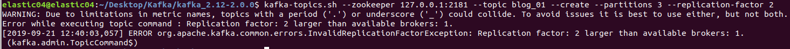

*Figure 16. Creating a topic.*

Browse

We can see all available topics: Kafka-topics.sh –zookeeper 127.0.0.1:2181 –List

It does show us the topic that we have created manually

Show

To see in detail a topic: Kafka-topics.sh –zookeeper 127.0.0.1:2181 –topic blog_01 –describe

Delete

```text
Kafka-topics.sh –zookeeper 127.0.0.1:2181 –topic blog_02 –d
```

#### Kafka consumer and Producer

The Producer will be responsible for sending the data to Kafka and the consumer of reading them.

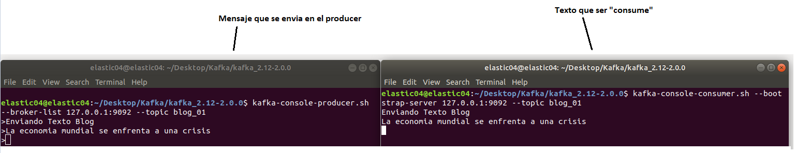

*Figure 17. Producer and consumer.*

#### Kafka and Java

We have seen how to manually enter our consumers and producers commands, the next step is to encapsulate it in a program in Java so that we can get the message. In our pom.xml file we will put all the dependencies that our project will need.

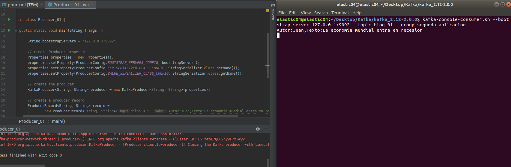

*Figure 18. Java consumer receiving messages.*

### Kafka in our Big Data architecture

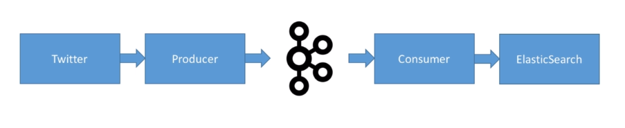

*Figure 19. Kafka in the project architecture.*

The first thing we have to do is create a developer account on twitter. Twitter is very jealous of who is “listening” their Tweets, as it is very valuable information.

To be able to work with tweets we had to send a request to Twitter telling that in this case it is a research project for the university. Once we have explained so that we want the data we receive the approval of Twitter. In our cluster Big Data, when we move to production that is to say we pretend to have.

#### Creating our Producer

There are different factors that we need to consider to build our producer. Since it is going to be a Java application, we have to pass to the pom.xml file the dependencies that we will need in maven.

We need:

- Dependencies of our program in Maven.
- twitter passwords
- Having installed ntp and running. (without this we were wrong)
Once we have created our client, we create the producer, the connection etc...

The time has come to see if it has worked. To do this we add in the list of words to look for 2 words “rare” so that we can visualize them more easily. In our case for a first verification that it works we name our company “Enriis-Consulting”.

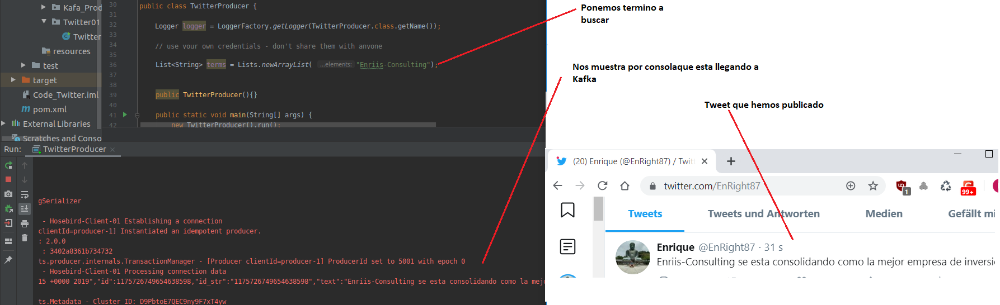

*Figure 20. Elasticsearch and MongoDB integration example.*

Once we have checked that it works, we put back in the list of words to look for, the words that we are interested in inserting in our architecture, that will be words that have relation to the economy “bitcoint”, “blockchain”, “crisis” etc..

### 4.3.2

#### Creating our consumer

The next thing we have to create is a consumer, which is where we're going to tell Kafka where we want the data to take us. The consumer basically takes the information that's stored in Kafka and sends it to target system in this case is our Elasticsearch database.

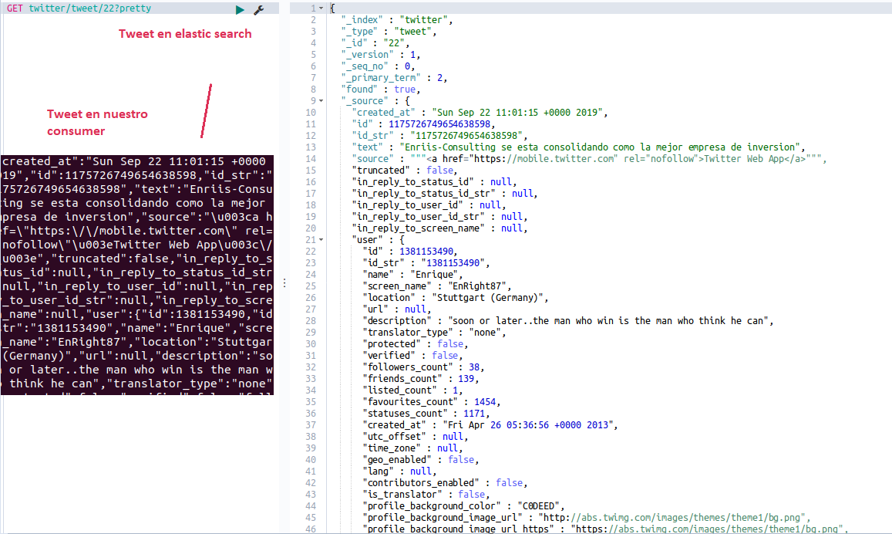

*Figure 17. Producer and consumer.*

## Chapter 5. Storage: MongoDB and Elasticsearch

### Introduction

I would like to start this chapter with a sentence that has marked what the philosophy of Big Data is.

In pioneer days they used oxen for heavy pulling, and when one ox could’t budget a log, they did’t try to grow a

longer ox. We shouldn’t be trying for biker computers, but for more systems of computers.

Grace Hopper

Obviously, our storage will be distributed. One of the challenges we find in Big Data infrastructures is that they have to be prepared to cope with the VS and Volume vs (in addition to others), that is to say our data volume is going to grow at a very fast speed and our volume is going to be very high.

#### Scale Up vs Scale out

Scale horizontally is not just a question of prices, but of capacity, scaling vertically can only be done to the maximum size supported by a machine.

Massive data processing:

As it is a Big Data infrastructure with exponential growth, we discard a traditional database system, a RDBMS where growth is “scaling up” and we will opt for a distributed database system, a NoSQL system where we can scale horizontally “scaling out” in this way if we need more storage power it will suffice to add “commodity software” horizontally, being a much cheaper and easier process to scale.


*Figure 21. Scaling up and scaling out.*

### MongoDB vs Elasticsearch

Once we have decided for a distributed storage and easily scalable, it is time to choose the database we will use.

We know that we will be inserting JSON documents as this is the format in which our spiders are working that collect the data from the Web pages and the data we send by twitter. At first we think of using MongoDB and Elasticsearch since they meet the fundamental requirements and both have many things in common, are NoSQL databases, are distributed, has replication in shards, both have a horizontal scaling which makes them perfect for large data chants and work with JSON Documents, MongoDB for documents and an Elasticsearch database to monitor infrastructure log etc...


*Figure 22. Elasticsearch and MongoDB.*

However, in the midst of the realization of this MFF, the following doubts arose.

Why the need for two databases distributed if not just one?

If MongoDB and Elasticsearch share climbing characteristics (horizontal), work with documents, replica etc... and besides Elasticserch allows us to work with log and monitor them and the most important thing is faster looking at documents than MongoDB.

What proposal has a database ? one of them and the most important is to support user queries to return the information that is being sought in the, if Elasticsearch makes this function much faster..

Why have Mongodb and not just be left with elasticsearch?

There is indeed a reason why one is not competition from the other, that is to say both are very successful products in the market and do not compete for the same niche, Elasticsearch in a search-engine and Mongodb is a Document-base engine there is an explanation (at least) so that both can live together in a Big Data ecosystem.

ETL

Effectively inserting into Elasticsearch and then making an ETL process is much more complicated than doing it in MongoDB, it is true that elastic provides Logstash where we can insert components of the ETL (Filtering, Funions, etc.) but it is not as complete as an ETL made in Python where the possibilities are infinite.

Compatibility of both Databases.

Once we have inserted our documents, we will go through an ETL process where we will clean and process them, we will do a MongoDB to elasticsearch where we will exercise functions of search and visualization of data.

Therefore, both databases are combined and complement each other.


*Figure 23. Using both distributed databases together.*

### MongoDB in our Infrastructure

MongoDB is going to be our primary database, in it all JSON documents that are coming from different data sources will be inserted.

#### Schema on read vs Schema on write

The schema on read vs schema on write model is important when choosing MongoDB as our primary database, even with other SQL alternatives.

Schema on read: It means that to insert the data we do not need to match our documents perfectly with the schema of previously existing documents, that is to say this is a storage concept, first we store all these Giga so Teras of data that we have already see what we do with them, schema on read contrary to other databases (especially the Relational ones) only obliges us to maintain some structure in the documents when reading them but not when it comes to storing them, if it were a schema on write database would mean that if we tried to insert a document in a given index but with another structure to the predefined one would fail. Precisely before reading those documents what we can do is different transformation processes about them in programs like Python thanks to the Api of Mongodb Pymongo, therefore, if we have two data sources that store documents with different structures, we will first store them with Python and then we will then integrate them and read them.


*Figure 24. Data integration with MongoDB.*

#### Primary databases and fault tolerance

Failure tolerance and high availability.

Opting for a distributed system as a solution for our use case has apart from the advantage we have seen before of Scaling up vs sclaing out, another fundamental advantage of which is a fault-tolerant system.

Failure tolerance is mainly addressed by:

Replication: It consists of providing multiple identical cases in the same system or subsystem, directing the tasks or requests of all of them in parallel.

Redundancy: It consists of providing multiple identical cases in the same system and the possibility of switching to one of the remaining cases in case of failure.

Replication vs Redundance:

The difference between replication and redundancy is that, in redundancy, the whole system is duplicated every certain time by a Backup system and in case my main system fails then I use my secondary system, in replication the nodes are also duplicated and these nodes are syncing between them within the cluster.

In our particular case we will use the technique of “replication” to have a fault-tolerant system.

MongoDB deployment s in a cluster with multiple servers, two concepts are key: Sharding and Replica

Sharding: It consists of partitioning the data between the servers we have, the shards can be added or removed without needing to take the database to offline.

Replica: Maintains high availability of our database, using redundant copying of data through servers. It consists of two types of nodes.

Primary: Receives all writing operations.

Secondary: Secondary nodes replicate the logical operations of the primary node to its data set in the way that the primary data set is reflected in the secondary node, if the primary node falls, a secondary node chosen becomes the primary node.

The minimum recommended replica configuration in MongoDB is 3, consisting of a primary node and two secondary nodes.


*Figure 25. Kafka and MongoDB.*

Hardware Considerations and Scaled

Determine how much data capacity we will have to deal with: We must decide the size of the working set through analyzing the “Queries” to know how much data we will need to access at once, calculate the number of requests per second we will want to support.

- Do a Concept Test (POC): MongoDB allows you to test the application with 10% of software and hardware, thanks to this you can improve performance and correct bugs
- Test it with a real workload: Do not deploy until tested with real-world data.
- Monitor and make adjustments: The increase of users inevitably requires an increase in our storage capacity, new indices etc.
Our Big Datra infrastructure: The data that is estimated to be generated from extracting information from blogs first year will be 1TB, since we have replica 3, we have to face the storage capacity of 3TB. We choose a 10 shard cluster with 3 machines per 102.4GB shard each. Servers will be 10 Linux machines with a network computing power of 10 Gigabit.

## Chapter 6. Log Analysis with the Elastic Stack

### Introduction

In a Big Data architecture, millions of events occur, every device our company has connected, every service we have running generates logs.

Case of use in our project

Our Big Data architecture supports a company that wants to make investments based on text analysis of the opinions of economic experts, but in turn offers investment services for customers, so it supports a website, on this website people from the rest of the world connect to each other, every time someone connects to our website to see our services, Apache issues a Log whose analysis without the specific tools can be complicated. How to access the information we need? How do we look for a certain value? In a normal cluster we would have to use Linux commands like grep or find to search for values, however, as the number of logs grows these queries become very heavy not to say almost impossible to get the information we need. But this is not all, in a Big Data infrastructure there are numerous cases of use of monitoring and log: Access to certain directories, input and output of network packages, security etc...

Because these are so large amounts of logs, it is impossible to treat them all individually, because we cannot analyze all the logs that are generated, we cannot extract useful information. To help us ELK emerges as the solution to the problems mentioned above.

ELK to the rescue

ELK: It is the acronym for Elasticsearch (Database), Logstash(processing) and Kibana (visualization)


*Figure 26. Elastic Stack module.*

### Elasticsearch Architecture

If we use the OSI model to see where ElastiSearch will work, I would use layer 7 and layer 4.


*Figure 27. OSI model.*

#### Nodes

A node is simply a computer or instance where an Elasticsearch service is raised, the set of connected nodes is what we will call a cluster.

There are different types of nodes.

Master Node: It is the node that will control that everything works properly along the cluster. The rest of nodes rely on it to carry out their actions. Among their tasks are to create indexes, indicate that nodes are available and that node must be stored in a given data. It will be necessary to be as stable as possible, and a good practice would be to be a dedicated node.

Data Node: As its name indicates, it will be responsible for storing data. It will perform data search and recovery operations, as well as CRUD operations and create additions to them. It will involve a great amount of resources. If you want to achieve better returns you will recommend a horizontal data node escalation.

Ingesta nodes: They perform data preparation and processing tasks before indexing the information.

Coordinator nodes: They are basically load balancing nodes.

#### Indexes and documents

We now turn to how the existing information is structured in the “data nodes”.

Documents: Every event that you want to store in Elasticarch we will call it a document. Documents will be stored in JSON format. In addition to the data that documents include there are other types of unvisible data that are metadata. These metadata help Elasticsearch manage.

Index: An index is nothing more than a collection of documents with similar characteristics. To get an idea, it would be like a table in a structured database.


*Figure 28. Index and table comparison.*

##### Shards and replicas

Shards: The way ElasticSearch has to store your data in a distributed way is through shards (as we have seen in MongoDB).

Replica: It is only an exact copy of a Shard, with it we get tolerance to failures, the replica will not be found in the same node.

Apart from providing fault tolerance, the replica improves queries as if the CPU is working on a specific node in another query, Elasticsearch may decide to query another node that has the replica.

### Elasticsearch API

As we already know the Application Programming Interface are abstraction layers that offer functions and procedures for communicating with applications. Elasticsearch has numerous types of APIs.

#### REST API – status

##### Cluster API

##### Cluster Health

It allows us to check the status of the Cluster (name,shards,tasks,state,number of nodes).Although we have mounted a single node in our case, that node already belongs to a cluster.

The most important parameter that returns this API is “Cluster Status”:

-Green: All the shards have been successfully indexed

- Yellow: Primary shards have been inserted correctly, but with failure in replicas

- Red: Primary unindexed Shards.


*Figure 29. Checking cluster state in Dev Tools.*

Nodes Info

Provides information about all nodes in the cluster (Application HTTP port, IP, processes, operating system, host name, plugin.).

Cluster Stats

It allows us to consult statistics regarding the cluster.


*Figure 30. Cluster state.*

##### Cat API

It is very similar to the Cluster API but in this case, the results are shown in table form, which makes them much more readable.

Code: GET _cat/health


*Figure 31. Checking cluster health.*

Master Info

It provides information about the master node of a cluster.

Code: GET _cat/master

Info

It provides us with a list of indices with their state (green, yellow or red), number of shards that compose it primary and replicas, documents and disk size.

Code: GET _cat/Indices


*Figure 32. Checking indices.*

Shards Info

Provides information about the cluster master node

Code: Get _cat/shards

#### API REST - Indexes and Documents

The corresponding APIs for indexing JSON documents are listed below.

```text
Put
```

It may be the case that we need to insert a document manually, for whatever reason, in this case we will use the put command and the fields will follow in our Index. Put would be the equivalent of SQL to “Insert into Table values (value1,...valueN)”


*Figure 33. SQL insert and Elasticsearch indexing.*

```text
Get
```

Allows JSON documents to be consulted from an index through your ID. In this case we give you the id=1


*Figure 34. Reading data.*

```text
Delete
```

It allows you to remove documents from an index by specifying their corresponding ID. If we tried as in the previous section to collect the Document, it would give us False because it no longer exists.


*Figure 35. Deleting and querying data in Kibana.*

Update

It allows us to update a document based on a script. The function is that it consults the document, applies the script, our update is missing, what we want to add and reindex the document.


*Figure 36. Updating data in Kibana.*

Search API

URI Search The query itself can specify the search parameters that will return the matches found.

Code: GET salmon/_search

This would return all the documents we have inserted, if we wanted to do a simple query by author name, we used:

Code:Get salmon/_search?q=Author:Erlik

In this example, he would return all the names.

Search Templates

There is the possibility of conducting DSL queries in JSON format.

It serves for routine and complex searches where only the parameters need to be changed.


*Figure 37. Running queries.*

Search Templates

It is used for routine and complex searches where only the parameters need to be changed.

Search Shards

Returns the shards on which a search will be executed.

### Beats

#### Introduction

Beats are the different components that send information, making a comparison with the real world would be like microphones that listen somewhere in our infrastructure. The main destinations of the Beats will be either Elasticsearch or Logstash.

We will start by sending the events directly to Elasticsearch and then we will see how we can enter Logstash for processing.

Beats' family, growing more and more, initially created 3 and now they are already 7 officers. Let's do a little review after the Beats that we must include in our Big Data infrastructure.

#### Filebeat

It is the most used, as its own name indicates acts on text files. In our case we will monitor log files of an Apache Server, of a Web browser.

Our investment company will offer its services to customers, the activity that reaches us from outside our infrastructure will be very important to monitor. We want to monitor from which country you access,user Ageant, ip ..etc.

Fake Logs

In this project we do not yet have the website of our company, therefore, these logs will simulate them, for this we will use a project of generation of Fake logs.

Fake logs: https://github.com/kiritbasu/Fake-Apache-Log-Generator


*Figure 38. Example collected log.*

To generate the logs with Python library will be:

Code: Python apache-fake-log-gen.py –n 10 or LOG (if you want 10 logs). On the other hand in Filebeat settings, we must specify where to search for logs.


*Figure 39. Configuring the path to the log files.*

Once we have told filebeat where you should search for logs, we will have to activate in the configuration the option to send them to our Elasticsearch database and finally we will be able to monitor them in Kibana.

We check that our Filebeat is active and send Beats to Kibana for monitoring.

Code: Service filebeat start / service filebeat satus

Next thing you know, the Logs are coming in correctly, as we can see this asset and running.


*Figure 40. Kibana and Filebeat.*

The axis of the Y will indicate the number of Logs you have found while in axis X refers to the time dimension, in our image we can see that at 19:24 3 logs have been produced, at 19:29 5 and then at 19:31 another 10 logs more.

#### Metricbeat

Metricbeat is a computer monitoring system, will collect infrastructure metrics (CPU, HDD, RAM) and send them. Report to our database on Elasticsearch.

Once we have started the service, we can check that it is working correctly with the following command.

To view the metricbeat status we will use the command: Service metric status

To view the logs we will use the command: tail –f /var/log/metricbeat/metricbeat

The first time we want to activate the upload of visualizations between Kibana and Metricbeat we need to activate it, such activation can be done in two ways one within Kibana or by command.

./bin/metricbeat setup --dashboards –c /etc/metricbeat/metricbeat.yml

Once we have configured the sending of logs to Elasticsearch, we can view it this time in Kibana’s Dashboard tab. Dashboard is in System Overview and this default, later we will see how to configure our own Dashboards.


*Figure 41. Metricbeat in Kibana.*

#### Packetbeat

It is a sniffer analysis of network packages (like Wireshark) that recognizes the different network protocols, its goal is to hear what enters and what comes out of our infrastructure and show it in an orderly way.


*Figure 42. Packetbeat processing sequence.*

Once we have installed on our packagebeat team, we check status and start it

Service packetbeat status / Sevice packet beat start

Once we have checked that they are correctly inserted as indexes of our packetbeat, it is time to monitor it and test it.

At first our Dashboard is empty what we should do is open our browser and perform search queries to check how our Dashboard is filled with information.


*Figure 43. Packetbeat execution dashboard.*

#### Auditbeat

It is basically a security monitoring, it will collect system events (application, security, system) and send them to Kibana.

It is based on Auditd service, which is an audit system within Linux systems, in which we can create rules personally, in these rules is where we indicate what we want to monitor. If we go to our configuration file it is where we can see the different rules that we have created. By default the file integrity module is enabled.

We checked it works.

- Edit the Auditbeat.yml
- Since the rule of monitoring what is created in the most important directories among them is active /bin/, we create a harmless script there.
- Kibana will collect the information.
#### Libbeat

Finally, we make a small mention of Libbeat, which is the library with which we can set up the alerts ourselves, in our case this will make no sense that we created them for this particular project, but it should be noted that all the big companies have their own library created.

### Logstash

#### Introduction

We have seen before how to send events directly from Beats to Elasticsearch, speaking in terms of Data Integration, in ETL it is as if we had touched the E of Extraction and the L of Load and now we would go to see the T.


*Figure 44. Event processing in Logstash.*

Logstash input will come in our case mainly from Beat, but this could come from a lot of services or databases (Twitter,Github,Radis...).

Grok: It will be one of the main functions that we will use to specify, that we will want to extract from an event, helps us identify the different fields, has labelling functions.

GEOIP: An interesting filter that Logstash provides us is GEOIP that by geolocation enriches information to the Ip address that reach our infrastructure.

Encryption:Communication is encrypted, both incoming into the input part and output part.

Plugins: Logstash currently has about 200 plug-ins both in and out, but we may want to customise a plugin that does not exist, in this case Logstash provides us with all the information necessary for us to create our own plugin for our particular case.

Storage Tails: Finally, an interesting property that Elastic offers us is a storage tail, this is a kind of cache, that is, if our output service is down for any reason, you can temporarily save the data in a storage queue until our service is available again. The size of the queue is configured by ourselves, the larger the queue will be able to hold on collecting data while the service is down.

#### Installation and functions

Once Logstash is installed in our cluster we can start specifying the configuration, there are two ways to configure the functions, manually and through file, to do a first test we will do a first execution manually.

We're going to tell you that everything that's on the entry line, it takes it out of the standard exit.


*Figure 45. Testing and monitoring Logstash.*

Moving us into the configuration file is going to be much easier than creating our rules by hand on the screen.

To create our monitoring rules we will enter config. We have seen above that there are numerous monitoring plugins, in our case we will use File. We put our first rule using the plugin – File. Listen to the logs we write inside a file.

The output will print it out to us by the standard output. To test it, let's try that file


*Figure 46. Logstash output.*

This is a log that monitors when you have inserted our scripts into the database, we have the specific information that we have received, the information is already very clean but for example in size we want to remove the "k" so that we can treat it as a number and so we can do the sum, mean etc...

To carry out this task we will need to plug in mutatis mutandis, within which we need to make use of “gsub”, then we adapt our file with the following configuration.

Logstash screen prints the new rules.


*Figure 47. First Logstash transformation.*

Add Field

As our company evolves, the database intake will not be based solely on web crowding of web pages but, for example we want to read twitter, will have turned to our database, coming from other sources etc...

In this case our data has entered through web-crawling script and we want to mark them, for this we create a new rule that will help us in the future to identify which volume of data have been inserted by script.

Use case: Let's imagine that in the future we want to count how many deployments have entered our system through scripts and web-crawling and how many have been by other methods.

Problem: Our unique script identifier has a very long and unique name, so you won't be able to make a Query de count to get the number, what we'll need is to add a new field that identifies if the entry in the system has come through script or another method and indicate it in that new field, so later we can do a few easier queries, this is done in logstat by.


*Figure 48. Second Logstash transformation.*

Grok

The Grok function is one of the most important in Logstag is a good way to break down a log into fields, so far we have inserted in JSON mode to do our tests, however in the future it is very possible that the logs only come as a text message, Grok will be able to break down that text into different fields.

Geoip

One of the most important functions we have is geolocation by ip, in this case.


*Figure 49. Enabling geolocation.*

#### Monitoring our infrastructure: Filebeat, Logstash, Elasticsearch.

Previously in the first section of Beats, we had seen how thanks to this service of ELK we could send information directly to Elasticsearch, on the other hand in Logstash we have seen how to treat logs, and to make small transformations in them by different rules that we write in our configuration file, in this section we will start monitoring our infrastructure with the combination of both services, that is to say on the one hand we will activate Filebeat and we will give you the instructions to send this information to Logstash, once there we will write a series of code so that we can treat that Log and process it more easily in Elasticsearch as final step will be Kibana.

Steps to follow:

- Go to filebeat.yml to modify that file, indicating that you send the logs to Logstash instead of directly to Elasticsearch.
- Restart the filebeat service to start reading the logs with the new configuration.
- Configure the new file in Logsh where we will indicate the new rules to be treated.
- We will use the following functions:
- Grok: To cut the log and indicate each field.
- Geoip: To enrich our log with geolocation ge information
- We also need to create an index


*Figure 50. Configuring Logstash for the ETL flow.*

- Start the service from Logstash
- etc/logstash/conf.d/apache.conf --path.settings=/etc/logstash
- Generate logs in Apache with our log generator script.
- etc/logstash/conf.d/apache.conf --path.settings=/etc/logstash
- Generate the indexes in Kibana to monitor them
We check our Logstash server that the localization information is arriving correctly.


*Figure 51. Geolocation data arriving correctly.*

- The next step is to check in Kibana that the information has indeed arrived in Elasticearh.
#### Created a coordinate map using geolocation: Mapping

In the previous section we have activated the following sequence Filebeat -> Logstash -> Elasticsearch -> Kibana.

Now that we already have some geolocation-enriched data, what we want is to create a map that we can visualize in a Dashboard. This process will be carried out through a “template”.

Steps to follow:

- We go to Logtash and create a folder called “template”.
- Inside the template folder we create a JSON file with the configuration we need, in our case we will indicate the fields we want to identify us, such as latitude, longitude. What we are interested in is above all to change your data type to be able to work with them.


*Figure 52. Custom template.*

- Insert our custom template into the elasticsearch templates.
```text
curl -XPUT 'http://localhost:9200/_template/apache' -H 'Content-Type: application/json' -d@/etc/logstash/templates/apache_template.json
```

- We checked that our template actually exists in elasticserh. Until now we had always used the GET _cat/Indices/* command to get the different indexes we had, now what we need is to see the schemas, and check if our schema has actually been successfully inserted.


*Figure 53. Apache template.*

All event that we index from now on in Apache* what you are going to do is match our schema that we have predefined and the data will have the type that we have specified.

- Delete our old Kibana and Elasticsearch index.
- One problem we found is that, if we had previously indexed a number of fields with a data type, and had recognized it as it was in our case as a string type, we cannot change the type on the go. In our case the only solution we found is to have to delete the Apache index we had previously.
Finally we can get to geolocation our Ip inputs


*Figure 54. Apache input logs displayed on a map.*

## Chapter 7. Data Visualization with Kibana

### Introduction

Kibana is the element in the pyramid of ELK, we have seen Elasticsearch and Logstash in depth and although we have already seen Kibana in this section we deepened even more in this powerful tool that provides Elasticsearch.

Kibana acts like other visualization tools like Tableau, QlikSense etc. do, with the difference that this tool has a lot of potential in processing Logs.


*Figure 55. Elastic Stack and Kibana.*

### Discover

It is a way of seeing each of the related events, you can apply queries and filters. It is the most used, you should be told which index you want to visualize, and you can interact with the time intervals to indicate each how much we want the information to show us. It can be adjusted every time we want to make the data refresh, you can interact with the screen and look at a certain specific time period.


*Figure 56. Viewing logs in Discover.*

The fields will be displayed by clicking on each event.

Discover provides above all a search engine where we can make queries, about our index, for example above we have the geolocation field geoip.city_name:Beiging, would return us all the data that match with our given query. In addition it allows us to include certain logic, that is to say we could enter conditions like AND.

Example: response:200 AND geoip.city_name:Beijing


*Figure 57. Adding a filter to the visualization.*

### Visualizations and Dashboards

In the end it is what we will look for, show our information in the most optimal way possible. It is one of the most important modules of ELK.

There are numerous types of Dashboards, and we could dedicate an entire chapter to it, but let's focus on the most basic ones. A dashboard is composed of different types of visualizations so in this section what we do is create different types of visualizations and join them so that at a simple glance we can see them all.

First view:

Event History: Where aggregation comes through Date Histogram, we also want to cut our bars through the “repose” field to see what type of response has been given. Once we have done this visualization we must save it, to use it in the future.


*Figure 58. Bar chart split by response code.*

Metric

The next thing we're going to choose is going to be a metric, specifically in our case we want to see the number of unique IPs that reach our server. Once we have the metric we save it the same.

The metric is a numerical value that we can insert somewhere in our Dashboard.

Donuts display

We will create a Donut display to visualize together the answers we are getting, in this way we have a clearer visualization of the general set of answers we are getting.


*Figure 59. Donut visualization.*

Table

We create a table display where we show a table in ranking with the information from the Ips of the countries that have visited us.


*Figure 60. Table visualization.*

Riding our Dashboard

Once we have the graphics we want to visualize, it's time to build our Dashboard.


*Figure 61. Combined final dashboard.*

### APM

It is one of the latest modules to integrate into ELK and monitors the performance of applications. In our Big Data infrastructure, our development team that is responsible for applying ML (NLP) to text documents, this module can be installed to monitor the performance of your programs, that is to say, an internal monitoring of the code we are creating. In this case we only mention it and do not work with it, but leave it for future lines.

## Chapter 8. Machine Learning with X-Pack

This module is in Elastic a payment module, so in this TFM you will only be able to put theoretical information.

### Machine Learning on server logs

Analyze a behavior and learn from it, everything that comes out of this behavior would be treated as an anomaly.

Machine Learning applied to the server.

Steps forward.

- Since we do not have millions of server logs, we import them, elastic already provides us with some data to do the tests.
- Code: wgethttps://download.elasticsearch.org/demos/machine_learning/gettingstarted/servermetrics.tar.gz
- We create the Server-metrics index using a custom template, this is similar to SQL Create table where it is said that fields will have the table, in this case the index structure is indicated.
- Code: curl -X PUT "localhost:9200/servermetrics" -H 'Content-Type: application/json'
- - We're putting the schema in here.
- Next thing we know, we're going to launch the data upload script that Elasticsearch provides.
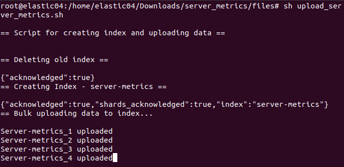

*Figure 62. Uploading data to Elasticsearch.*

The data we have uploaded is requests to a server, we have millions of files, it goes without saying that a human would be unable to pull patterns or outliers, that is why we want to see if Machine Learning can be identified.

When you create the job, you automatically start analyzing the data, and we see that it returns the following result, indicating that it has detected outliers.

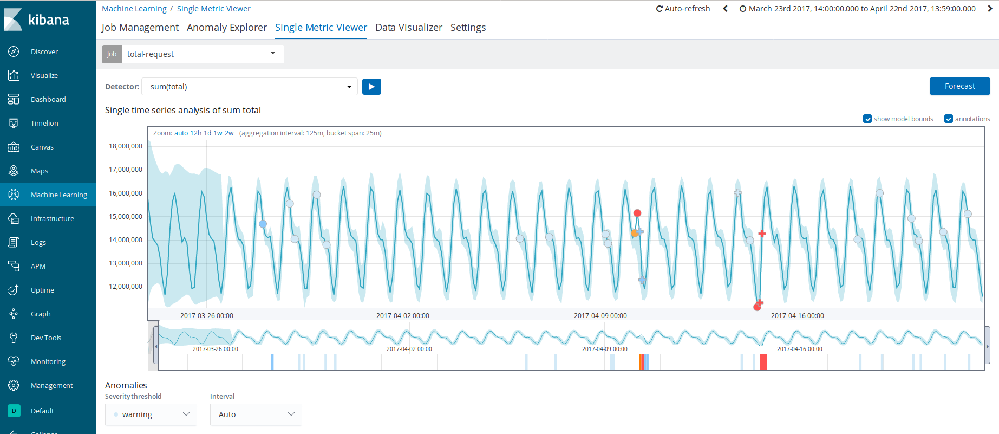

*Figure 63. Applying Machine Learning to logs.*

Zooming into the marked area, we see the anomaly more closely, using ML had identified a pattern of behavior that has not been given.

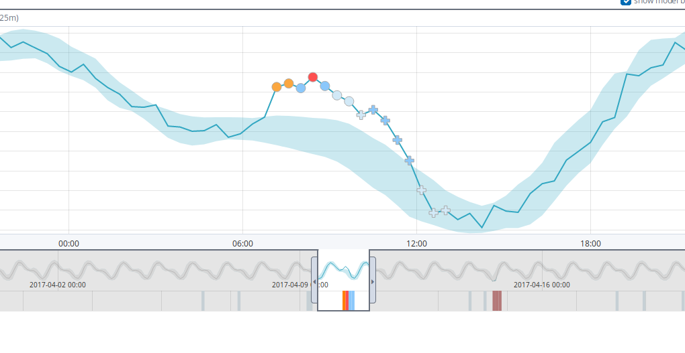

*Figure 64. Detailed view of anomalies.*

### ML applied to user activities.

We will apply ML to the activities that users are having in our infrastructure. In this case we will create an advanced job that will provide us with the possibility of adding a detector.

Steps to follow:

- We download again data that offers us elastic.
Code: wget https://download.elasticsearch.org/demos/machine_learning/gettingstarted/user-activity.json

- We indexed in elasticsearch.
Code: curl -s -X POST -H "Content-Type: application/json" localhost:9200/user-active

y/_bulk --data-binary "@user-activity.json"

The data represents the amount of Bytes that users are sending, so in this case the detector we are going to create will tell you to act on the average of the bytes that users send to our server and we will look for some anomaly, which follows a normal behavior, suddenly has unusual behavior.

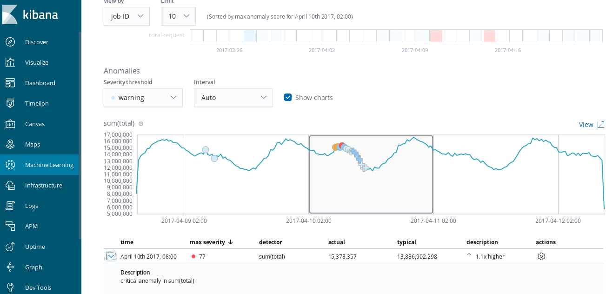

*Figure 65. Applying Machine Learning to user metrics.*

## Chapter 9. Conclusions and Future Work

Infrastructure

Cloud migration: Our project has been mounted using a computer and the help of different virtual machines, it has been intended to simulate a Big Data On-Premise infrastructure, the next logical step is to migrate all our On-Premise infrastructure to the cloud, virtualizing our services through Docker containers and orchestrating them through Kubernetes.

Jobs-Schelunder/Orquester: It is certainly a very important point that this TFM lacks the lack of a general orchestrator or software that programs Jobs are going to be released, and in which order. There are different orchestration programs like Uc4, Autosys or even Apache Airflow that is opensource, for topics of time it has not been possible to count on these tools.

Data Streaming: Without a doubt, a very interesting topic where you can delve into a lot, especially interesting applied to platforms like twitter. Apache-Stream or Apache Flink are two of the most interesting tools in this field.

Data Science

NLP: A feeling analysis of the text. To compare predictions, product and bag.

Avoid fraud: Authors “update” their texts, this can cause an author who had spoken negatively about a product to change his text depending on how the market evolves.

## Chapter 10. References

Tools and programs used

Scrapy: https://scrapy.org/

MongoDB: https://www.mongodb.com/download-center/community

Pymongo: https://api.mongodb.com/python/current/

Apache Kafka: https://kafka.apache.org/downloads

Elasticsearch: https://www.elastic.co/de/downloads/elasticsearch

Logtash: https://www.elastic.co/de/downloads/logstash

Beats: https://www.elastic.co/de/products/beats

Filebeat: https://www.elastic.co/guide/en/beats/filebeat/master/filebeat-getting-started.html

Auditbeat:https://www.elastic.co/guide/en/beats/auditbeat/current/auditbeat-installation.html

Metricbeat:https://www.elastic.co/guide/en/beats/metricbeat/current/metricbeat-installation.html

Kibana: https://www.elastic.co/de/downloads/kibana

Virtualbox: https://www.virtualbox.org/wiki/Downloads

Ubuntu: https://ubuntu.com/download/desktop

Fake-Apache-Log-Generator: https://github.com/kiritbasu/Fake-Apache-Log-Generator

## Bibliography

Todd Palino, Gwen Shapira, Neha Narkhede: “Kafka: The Definitive Guide”.

Ryan Michael : “Web Scraping with Python: Collecting More Data from the Modern Web”.

Radu Gheorghe, Matthew Lee Hinman, and Roy Russo: “Elasticsearch in Action”.

Eric Redmon and Jim Wilson: “Seven Databases in Seven Weeks: A Guide to Modern Databases and the NoSQL Movement.”

Martin Fowler: “NoSQL Distilled”.

Kafka documentation: https://www.confluent.io/

Elasticsearch documentation: https://www.elastic.co/guide/index.html

MongoDB vs Elasticsearch: https://medium.com/@ranjeetvimal/elasticsearch-vs-mongodb-631f410cd317

[Back to the English edition](../README.md)
